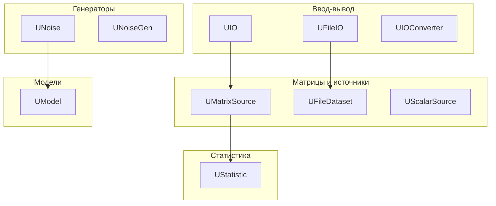
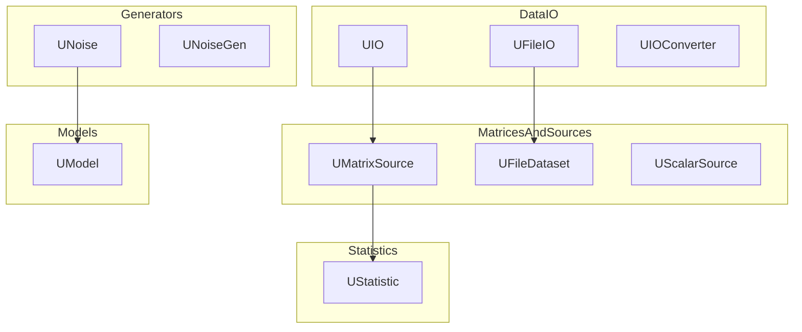

# Архитектура Rdk-BasicLib

## RU

### Обзор

Rdk-BasicLib организована по категориям компонентов, каждая из которых решает определенную задачу работы с данными.

### Структура библиотеки

### Основные модули

#### Ввод-вывод данных

- **UIO** - базовый компонент для операций ввода-вывода
- **UFileIO** - работа с файловым вводом-выводом
- **UIOConverter** - конвертер данных между форматами

#### Матрицы и источники данных

- **UMatrixSource** - базовый источник матричных данных
- **UMatrixSourceFile** - источник из файла
- **UFileDataset** - работа с датасетами из файлов
- **UScalarSource** - источник скалярных данных

#### Статистика

- **UStatistic** - статистические вычисления и анализ данных

#### Генераторы данных

- **UNoise** - генерация шума различных типов
- **UNoiseGen** - генератор шума с параметрами

#### Модели

- **UModel** - базовый компонент математических моделей

### Зависимости

- `rdk.static.qt` - ядро Rdk

### См. также

- [Usage-Examples.md](Usage-Examples.md) - примеры использования
- [API-Overview.md](API-Overview.md) - обзор API

---

## EN

### Overview

Rdk-BasicLib is organized by component categories, each solving specific data handling tasks.

### Library Structure

The diagram shows the high-level grouping of components and typical data flow: data sources feed processing/statistics components, and generator components feed models.

### Main Modules

#### Data I/O

- **UIO** - base component for I/O operations
- **UFileIO** - file I/O operations
- **UIOConverter** - data converter between formats

#### Matrices and Data Sources

- **UMatrixSource** - base matrix data source
- **UMatrixSourceFile** - file-based source
- **UFileDataset** - dataset from files
- **UScalarSource** - scalar data source

#### Statistics

- **UStatistic** - statistical computations and data analysis

#### Data Generators

- **UNoise** - noise generation of various types
- **UNoiseGen** - noise generator with parameters

#### Models

- **UModel** - base component for mathematical models

### Dependencies

- `rdk.static.qt` - Rdk core

### See Also

- [Usage-Examples.md](Usage-Examples.md) - usage examples
- [API-Overview.md](API-Overview.md) - API overview
