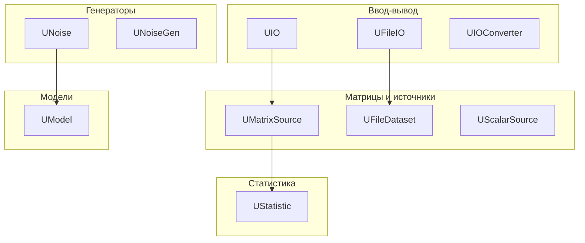
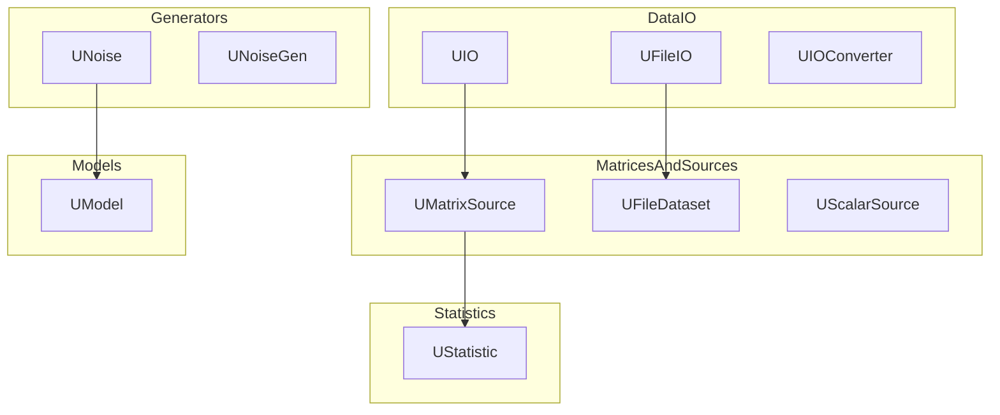

# Архитектура Rdk-BasicLib

## RU

### Обзор

Rdk-BasicLib организована по категориям компонентов, каждая из которых решает определенную задачу работы с данными.

### Структура библиотеки



### Основные модули

#### Ввод-вывод данных

- **UIO** - базовый компонент для операций ввода-вывода данных. Предоставляет интерфейс для чтения и записи данных различных форматов
- **UFileIO** - работа с файловым вводом-выводом (опционально, зависит от платформы)
- **UIOConverter** - конвертер данных для преобразования между различными форматами
- **UIOTextConverter** - текстовый конвертер данных

#### Матрицы и источники данных

- **UMatrixSource** - базовый источник матричных данных. Абстрактный класс для получения матричных данных. Наследники реализуют конкретные способы получения данных: из файлов, из временных рядов, из других компонентов
- **UMatrixSourceDataFile** - источник матричных данных из файла
- **UMatrixSourceFile** - источник матричных данных из файла (Windows-специфичный)
- **UMatrixSourceFileSep** - источник матричных данных из файла с разделителями
- **UMatrixSourceTimeSeries** - источник временных рядов (матричных данных с временной меткой)
- **UScalarSource** - источник скалярных данных
- **UFileDataset** - работа с датасетами из файлов (Windows-специфичный)

#### Статистика

- **UStatistic** - компонент для статистических вычислений и анализа данных. Поддерживает:
  - Вычисление средних значений
  - Дисперсия и стандартное отклонение
  - Корреляция
  - Другие статистические метрики

#### Генераторы данных

- **UNoise** - компонент для генерации шума различных типов
- **UNoiseGen** - генератор шума с различными параметрами и распределениями. Используется для:
  - Тестирования компонентов
  - Добавления шума к данным
  - Симуляции неопределенности

#### Модели

- **UModel** - базовый компонент математических моделей

### Ключевые классы

#### UBasicLib

Главный класс библиотеки, регистрирующий все компоненты:

```cpp
class UBasicLib: public ULibrary
{
public:
    UBasicLib(void);
    virtual void CreateClassSamples(UStorage *storage);
};
```

Библиотека автоматически загружается при инициализации системы через `RdkLoadPredefinedLibraries()`:

```cpp
libs_list.push_back(&RDK::BasicLibrary);
```

### Зависимости

- **rdk.static.qt** - ядро Rdk (обязательно)
- Стандартная библиотека C++
- Платформо-зависимые библиотеки для файлового IO (Windows)

### Зависимости от этой библиотеки

Следующие библиотеки зависят от Rdk-BasicLib:

- **Nmsdk-PulseLib** - использует источники данных и статистику
- **Nmsdk-MotionControlLib** - использует источники данных

### Примеры использования

#### Источник данных из файла

```cpp
// Создание источника матричных данных из файла
UMatrixSourceDataFile* source = storage->CreateComponent<UMatrixSourceDataFile>();
// Настройка пути к файлу и параметров чтения
```

#### Генератор шума

```cpp
// Создание генератора шума
UNoiseGen* noiseGen = storage->CreateComponent<UNoiseGen>();
// Настройка типа шума и параметров
```

#### Статистика

```cpp
// Создание компонента статистики
UStatistic* stat = storage->CreateComponent<UStatistic>();
// Подключение к источнику данных и вычисление статистики
```

### Файлы библиотеки

#### Core компоненты

- `UBCLLibrary.h/cpp` - главный класс библиотеки
- `UIO.h/cpp` - базовый IO компонент
- `UIOConverter.h/cpp` - конвертер данных
- `UFileIO.h/cpp` - файловый IO
- `UIOTextConverter.h/cpp` - текстовый конвертер
- `UMatrixSource.h/cpp` - базовый источник матриц
- `UMatrixSourceDataFile.h/cpp` - источник из файла
- `UMatrixSourceFile.h/cpp` - источник из файла (Win)
- `UMatrixSourceFileSep.h/cpp` - источник с разделителями
- `UMatrixSourceTimeSeries.h/cpp` - временные ряды
- `UScalarSource.h/cpp` - источник скаляров
- `UFileDataset.h/cpp` - работа с датасетами
- `UStatistic.h/cpp` - статистика
- `UNoise.h/cpp` - шум
- `UNoiseGen.h/cpp` - генератор шума
- `UModel.h/cpp` - модель

### См. также

- [Usage-Examples.md](Usage-Examples.md) - примеры использования
- [API-Overview.md](API-Overview.md) - обзор API

---

## EN

### Overview

Rdk-BasicLib is organized by component categories, each solving specific data handling tasks.

### Library Structure



The diagram shows the high-level grouping of components and typical data flow: data sources feed processing/statistics components, and generator components feed models.

### Main Modules

#### Data I/O

- **UIO** - base component for data I/O operations. Provides interface for reading and writing data in various formats
- **UFileIO** - file I/O operations (optional, platform-dependent)
- **UIOConverter** - data converter for transforming between different formats
- **UIOTextConverter** - text data converter

#### Matrices and Data Sources

- **UMatrixSource** - base matrix data source. Abstract class for obtaining matrix data. Derived classes implement specific ways to get data: from files, from time series, from other components
- **UMatrixSourceDataFile** - matrix data source from file
- **UMatrixSourceFile** - matrix data source from file (Windows-specific)
- **UMatrixSourceFileSep** - matrix data source from file with separators
- **UMatrixSourceTimeSeries** - time series source (matrix data with timestamp)
- **UScalarSource** - scalar data source
- **UFileDataset** - dataset operations from files (Windows-specific)

#### Statistics

- **UStatistic** - component for statistical computations and data analysis. Supports:
  - Mean value computation
  - Variance and standard deviation
  - Correlation
  - Other statistical metrics

#### Data Generators

- **UNoise** - component for noise generation of various types
- **UNoiseGen** - noise generator with various parameters and distributions. Used for:
  - Component testing
  - Adding noise to data
  - Uncertainty simulation

#### Models

- **UModel** - base component for mathematical models

### Key Classes

#### UBasicLib

Main library class that registers all components:

```cpp
class UBasicLib: public ULibrary
{
public:
    UBasicLib(void);
    virtual void CreateClassSamples(UStorage *storage);
};
```

The library is automatically loaded during system initialization via `RdkLoadPredefinedLibraries()`:

```cpp
libs_list.push_back(&RDK::BasicLibrary);
```

### Dependencies

- **rdk.static.qt** - Rdk core (required)
- Standard C++ library
- Platform-dependent libraries for file IO (Windows)

### Libraries Depending on This Library

The following libraries depend on Rdk-BasicLib:

- **Nmsdk-PulseLib** - uses data sources and statistics
- **Nmsdk-MotionControlLib** - uses data sources

### Usage Examples

#### Data Source from File

```cpp
// Create matrix data source from file
UMatrixSourceDataFile* source = storage->CreateComponent<UMatrixSourceDataFile>();
// Configure file path and reading parameters
```

#### Noise Generator

```cpp
// Create noise generator
UNoiseGen* noiseGen = storage->CreateComponent<UNoiseGen>();
// Configure noise type and parameters
```

#### Statistics

```cpp
// Create statistics component
UStatistic* stat = storage->CreateComponent<UStatistic>();
// Connect to data source and compute statistics
```

### Library Files

#### Core Components

- `UBCLLibrary.h/cpp` - main library class
- `UIO.h/cpp` - base IO component
- `UIOConverter.h/cpp` - data converter
- `UFileIO.h/cpp` - file IO
- `UIOTextConverter.h/cpp` - text converter
- `UMatrixSource.h/cpp` - base matrix source
- `UMatrixSourceDataFile.h/cpp` - file source
- `UMatrixSourceFile.h/cpp` - file source (Win)
- `UMatrixSourceFileSep.h/cpp` - source with separators
- `UMatrixSourceTimeSeries.h/cpp` - time series
- `UScalarSource.h/cpp` - scalar source
- `UFileDataset.h/cpp` - dataset operations
- `UStatistic.h/cpp` - statistics
- `UNoise.h/cpp` - noise
- `UNoiseGen.h/cpp` - noise generator
- `UModel.h/cpp` - model

### See Also

- [Usage-Examples.md](Usage-Examples.md) - usage examples
- [API-Overview.md](API-Overview.md) - API overview
