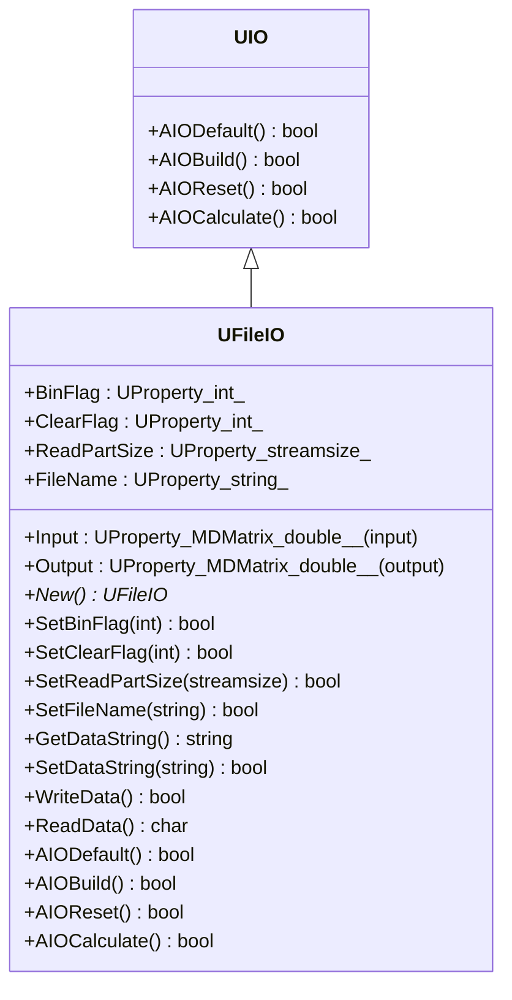
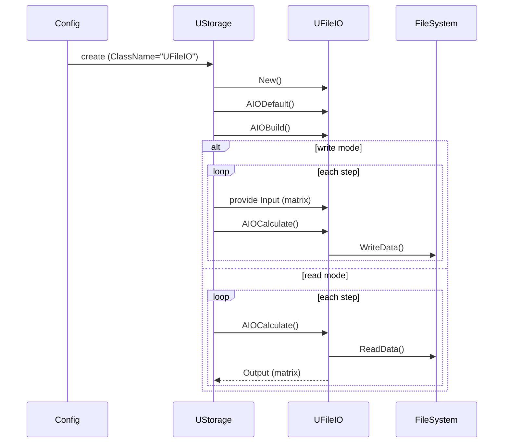
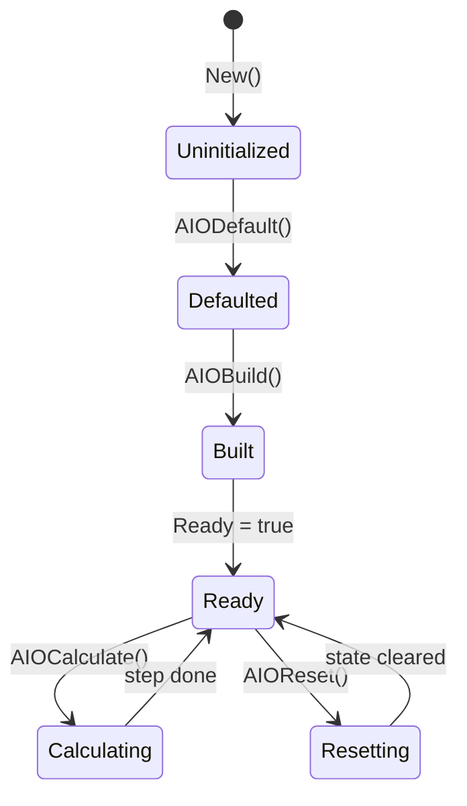
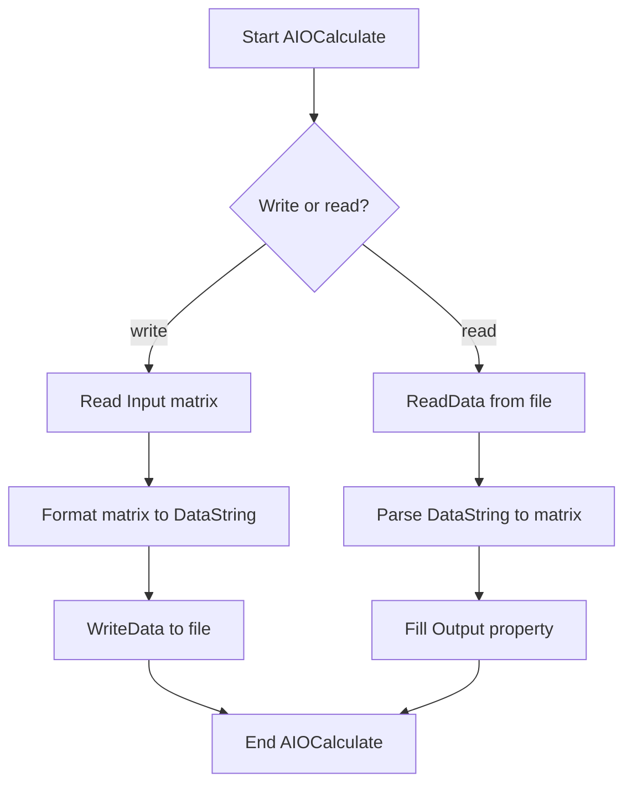
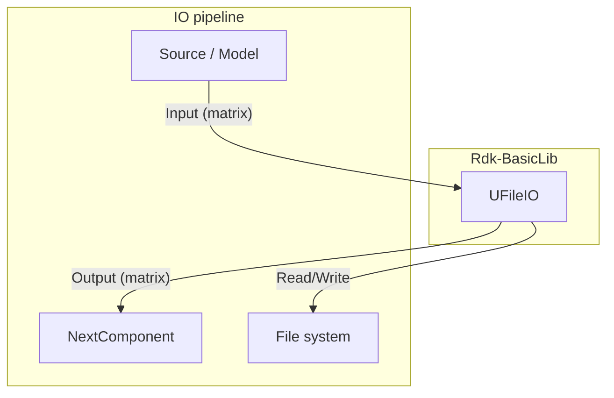

## UFileIO — файловый ввод/вывод (Rdk-BasicLib)

## RU

### Назначение

**Класс**: `UFileIO` — компонент ввода/вывода матричных данных в файлы.  
**Базовый класс**: `UIO` (см. `UIO.h`).  
Используется для чтения матриц из файлов и записи результатов вычислений на диск.

### UML-диаграмма классов



### UML-диаграмма последовательности



### UML-диаграмма состояний



### UML-диаграмма активности



### UML-диаграмма компонентов



### Свойства

По объявлению в `UFileIO.h`:

- **`BinFlag`** (`int`, `ptPubParameter`) — режим бинарного ввода/вывода (0 — текст, 1 — бинарный).
- **`ClearFlag`** (`int`, `ptPubParameter`) — очищать ли файл перед записью (1 — перезапись, 0 — дозапись).
- **`ReadPartSize`** (`std::streamsize`, `ptPubParameter`) — размер порции чтения.
- **`FileName`** (`std::string`, `ptPubParameter`) — путь к файлу.
- **`Input`** (`UProperty<MDMatrix<double>, ..., ptInput>`) — входная матрица для записи.
- **`Output`** (`UProperty<MDMatrix<double>, ..., ptOutput>`) — выходная матрица при чтении.

### Методы

- `UFileIO()`, `~UFileIO()` — конструктор/деструктор.
- `virtual UFileIO* New()` — фабрика экземпляров.
- `SetBinFlag`, `SetClearFlag`, `SetReadPartSize`, `SetFileName` — настройка параметров ввода/вывода.
- `GetDataString`, `SetDataString` — доступ к внутреннему строковому буферу данных.
- `WriteData()`, `ReadData()` — низкоуровневые операции с файлом.
- `AIODefault()`, `AIOBuild()`, `AIOReset()`, `AIOCalculate()` — жизненный цикл IO-компонента.

### Примеры использования в C++

```cpp
#include "UFileIO.h"

using namespace RDK;

void SaveMatrixToFile(const MDMatrix<double>& data, const std::string& path)
{
    UFileIO* io = new UFileIO();
    io->AIODefault();
    io->SetFileName(path);
    io->SetBinFlag(0);    // текстовый режим
    io->SetClearFlag(1);  // перезаписать файл
    io->AIOBuild();

    *io->Input = data;
    io->AIOCalculate();   // выполняет запись

    delete io;
}
```

### Примеры использования в конфигурациях

Конкретные конфигурации с `UFileIO` могут быть добавлены по мере необходимости; типичный фрагмент:

```xml
<FileIO Class="UFileIO">
    <Parameters>
        <FileName Type="s" PType="257" IoType="17">output.txt</FileName>
        <BinFlag Type="i" PType="257" IoType="17">0</BinFlag>
        <ClearFlag Type="i" PType="257" IoType="17">1</ClearFlag>
    </Parameters>
</FileIO>
```

---

## UFileIO — file input/output (Rdk-BasicLib)

## EN

### Purpose

**Class**: `UFileIO` — matrix file input/output component based on `UIO`.  
It reads `MDMatrix<double>` from files and writes matrices to disk according to configuration.

### Notes

- Binary/text mode, clear/append, block size and file path are controlled via `BinFlag`, `ClearFlag`, `ReadPartSize`, and `FileName`.
- Input/output matrices are exposed via `Input` and `Output` `UProperty` objects.
- Lifecycle follows `UIO`: `AIODefault` → `AIOBuild` → repeated `AIOCalculate` → optional `AIOReset`.  
Mermaid diagrams in the RU section describe class relationships, lifecycle, activity, and component interactions. 

