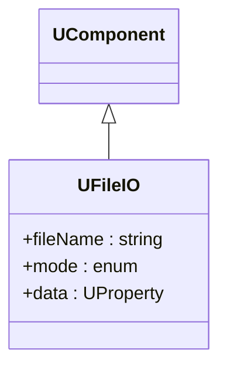
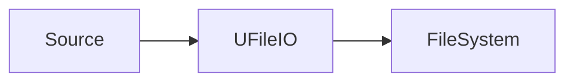

## UFileIO — файловый ввод/вывод (Rdk-BasicLib)

**Класс**: `UFileIO` — компонент работы с файлами (чтение/запись данных).  
**Storage-компоненты**: `UploadClass("UFileIO", ...)` с параметрами пути, режима и формата.

### Регистрация
- Файл библиотеки: `Libraries/Rdk-BasicLib/Core/UIOLibrary.cpp`.
- Метод: `CreateClassSamples(...)` → `UploadClass("UFileIO", ...)`.

### Класс и связи

### Входы/выходы
- Вход: данные в `UProperty` (при записи) или путь/команда.
- Выход: заполненный `UProperty` (при чтении) или файл на диске.

### Storage-инстансы
- В `ClDesc`/`Configs`: `ClassName = "UFileIO"`, свойства `FileName`, `Mode` и описание подключённых свойств.

Пояснение: блок-схема показывает поток данных/сигналов (входы → компонент → выходы).

---

## UFileIO — file input/output (Rdk-BasicLib)

**Class**: `UFileIO` — reads/writes data to files according to configuration.  
**Storage**: instances configured via `ClassName = "UFileIO"` with file name and mode.

