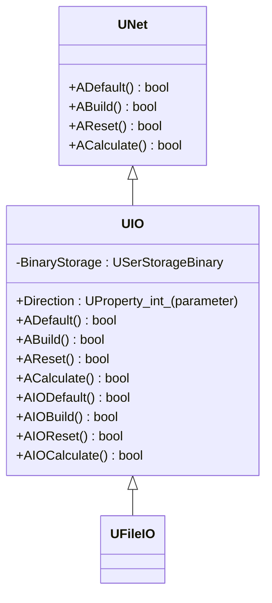
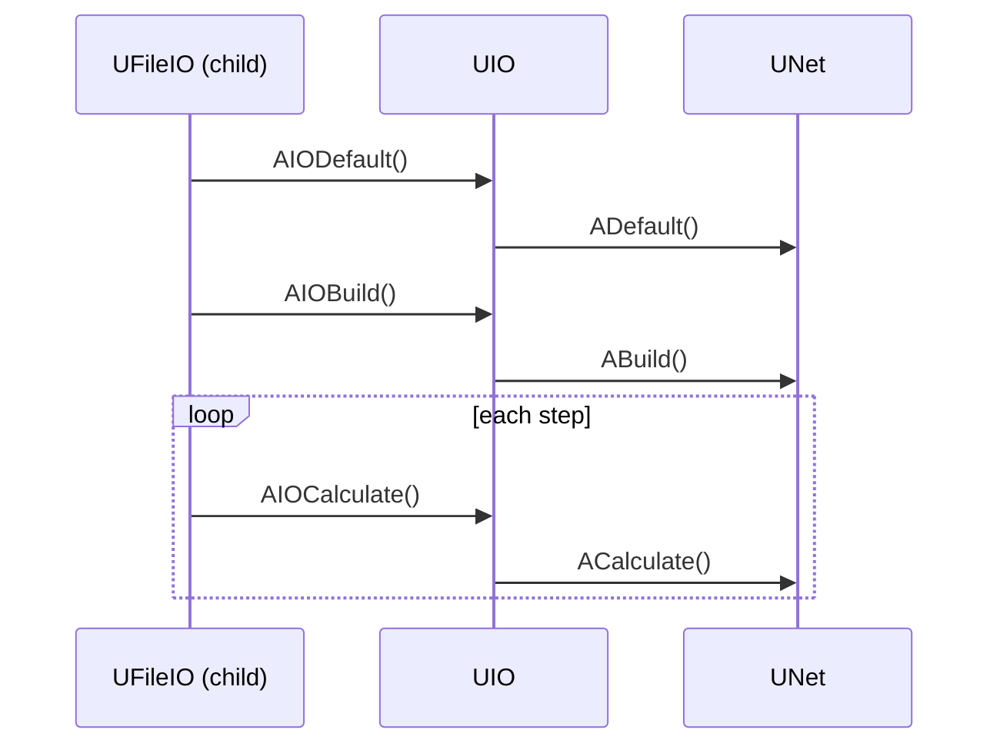
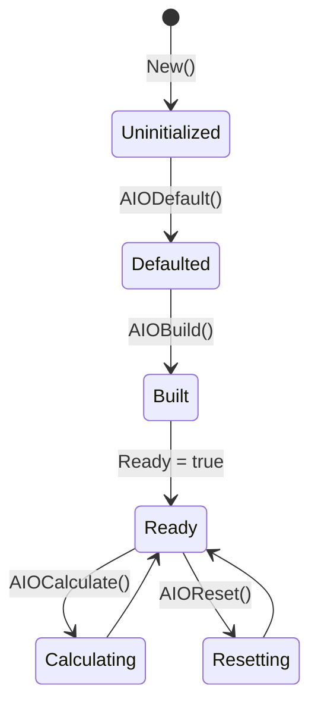
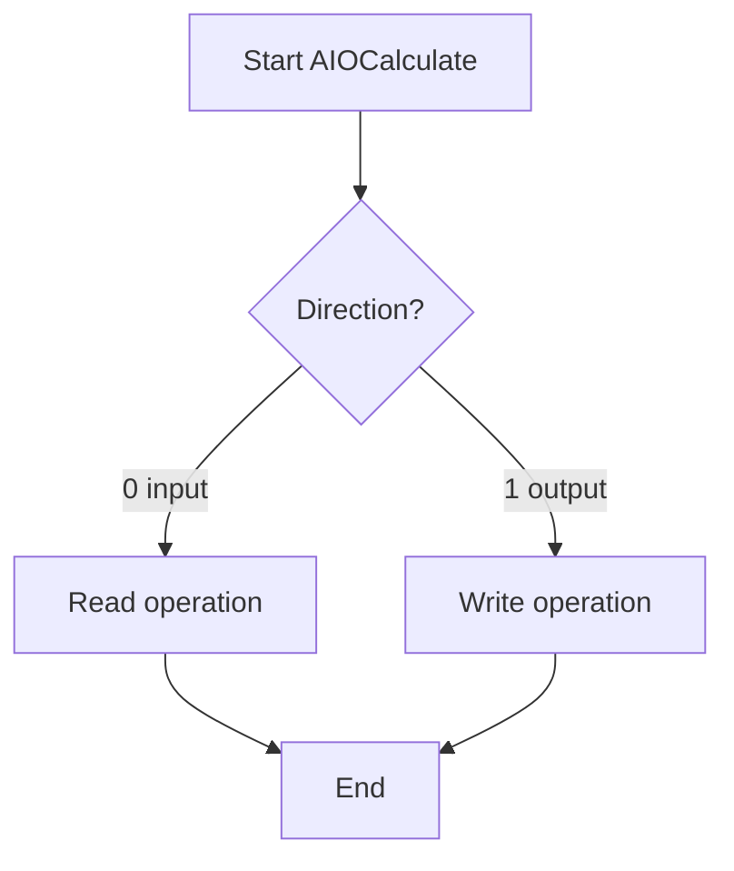
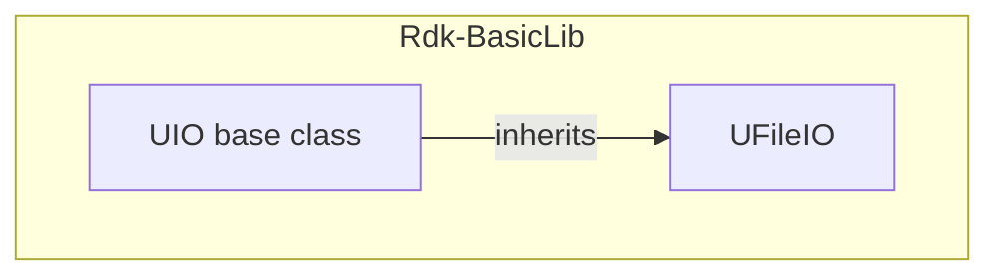

## UIO — базовый класс ввода/вывода (Rdk-BasicLib)

## RU

### Назначение

**Класс**: `UIO` — базовый абстрактный класс для компонентов ввода/вывода данных.  
**Базовый класс**: `UNet`.  
Не регистрируется напрямую в `UStorage`, используется как родительский класс для специализированных IO-компонентов (например, `UFileIO`).

### UML-диаграмма классов

### UML-диаграмма последовательности

### UML-диаграмма состояний

### UML-диаграмма активности

### UML-диаграмма компонентов

### Свойства

Из `UIO.h`:

- **`Direction`** (`int`, `ptPubParameter`) — направление работы:
  - 0 — ввод информации.
  - 1 — вывод информации.

Внутренние:

- **`BinaryStorage`** (`USerStorageBinary`) — хранилище двоичных данных для ввода/вывода.

### Методы

Жизненный цикл (два уровня):

- Верхний уровень (наследуется от `UNet`):
  - `ADefault`, `ABuild`, `AReset`, `ACalculate`.
- Специализированный уровень IO:
  - `AIODefault`, `AIOBuild`, `AIOReset`, `AIOCalculate`.

Методы IO-уровня обычно вызываются из производных классов и делегируют работу верхнему уровню или реализуют специфичную для IO логику.

### Использование

`UIO` не используется напрямую в конфигурациях, но служит базой для:
- `UFileIO` — файловый ввод/вывод.
- Других специализированных IO-компонентов.

---

## UIO — base IO class (Rdk-BasicLib)

## EN

### Purpose

**Class**: `UIO` is an abstract base class for input/output components, extending `UNet`.  
It is not registered directly in `UStorage` but serves as a parent for specialized IO classes like `UFileIO`.

### Notes

- `Direction` property controls whether the component performs input (0) or output (1) operations.
- The class provides both standard `UNet` lifecycle methods and specialized `AIO*` methods for IO-specific logic.
- Mermaid diagrams in the RU section show inheritance, lifecycle and component relationships.
