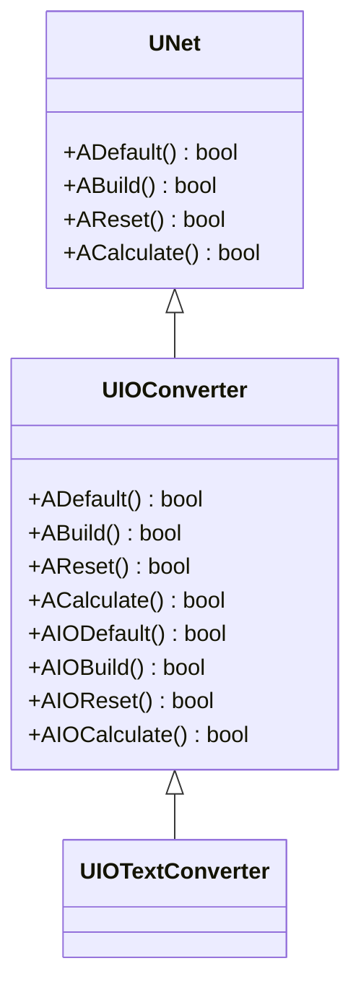
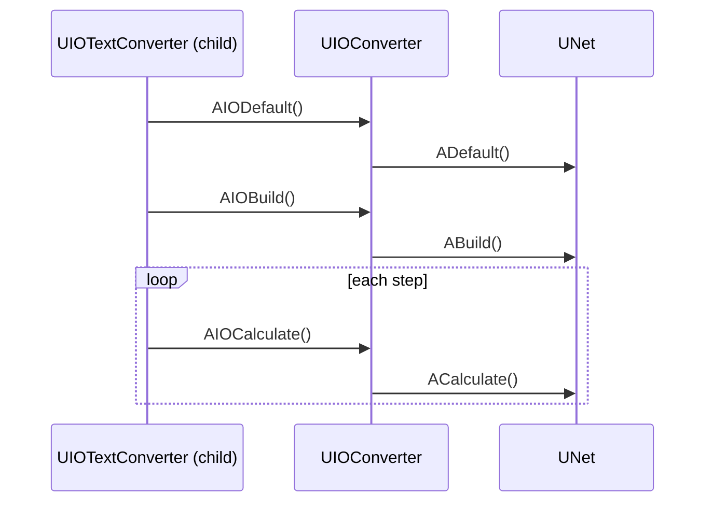
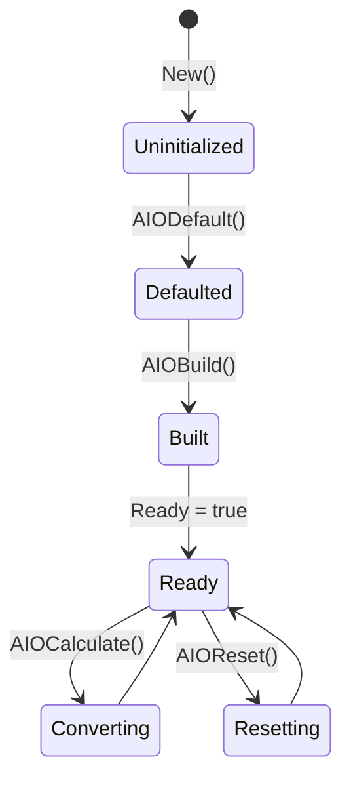
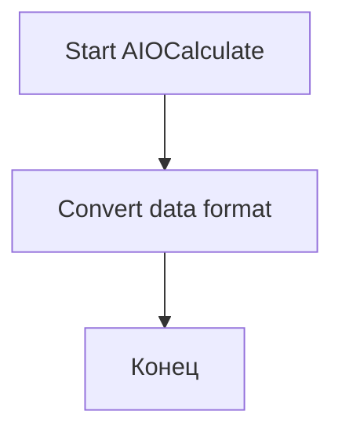
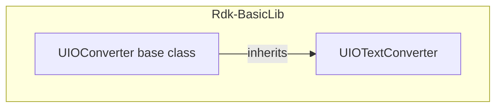

## UIOConverter — базовый класс конвертеров IO (Rdk-BasicLib)

## RU

### Назначение

**Класс**: `UIOConverter` — базовый абстрактный класс для компонентов преобразования данных в IO-контексте.  
**Префикс**: `IO` — **I**nput/**O**utput (ввод-вывод).  
**Базовый класс**: `UNet`.  
Не регистрируется напрямую в `UStorage`, используется как родительский класс для специализированных конвертеров (например, `UIOTextConverter`).

### UML-диаграмма классов

### UML-диаграмма последовательности

### UML-диаграмма состояний

### UML-диаграмма активности

### UML-диаграмма компонентов

### Методы

Жизненный цикл (два уровня):

- Верхний уровень (наследуется от `UNet`):
  - `ADefault`, `ABuild`, `AReset`, `ACalculate`.
- Специализированный уровень IO:
  - `AIODefault`, `AIOBuild`, `AIOReset`, `AIOCalculate`.

Производные классы переопределяют методы IO-уровня для реализации конкретных преобразований данных.

### Использование

`UIOConverter` не используется напрямую в конфигурациях, но служит базой для:
- `UIOTextConverter` — преобразование между числовым и текстовым форматами.
- Других специализированных конвертеров данных.

---

## UIOConverter — base IO converter class (Rdk-BasicLib)

## EN

### Purpose

**Class**: `UIOConverter` is an abstract base class for data conversion components in IO context, extending `UNet`.  
It is not registered directly in `UStorage` but serves as a parent for specialized converters like `UIOTextConverter`.

### Notes

- Provides both standard `UNet` lifecycle methods and specialized `AIO*` methods for conversion logic.
- Derived classes implement specific conversion algorithms in their `AIOCalculate` methods.
- Mermaid diagrams in the RU section show inheritance, lifecycle and component relationships.
