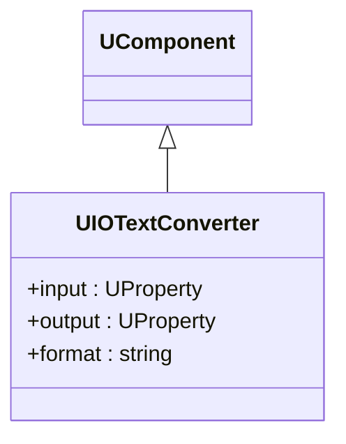

## UIOTextConverter — текстовый конвертер IO (Rdk-BasicLib)

**Класс**: `UIOTextConverter` — преобразует данные между бинарным/внутренним представлением и текстовым форматом.  
**Storage-компоненты**: `UploadClass("UIOTextConverter", ...)`.

### Класс

### Входы/выходы
- Вход: `UProperty` с данными (матрица/скаляр/структура).
- Выход: текстовое представление (строка, файл) или обратно — в зависимости от режима.

### Storage-инстансы
- В конфигах: `ClassName = "UIOTextConverter"`; параметры определяют формат (разделители, заголовки и т.п.).

---

## UIOTextConverter — IO text converter (Rdk-BasicLib)

**Class**: `UIOTextConverter` — converts between internal data and textual representation for interoperability/logging.

