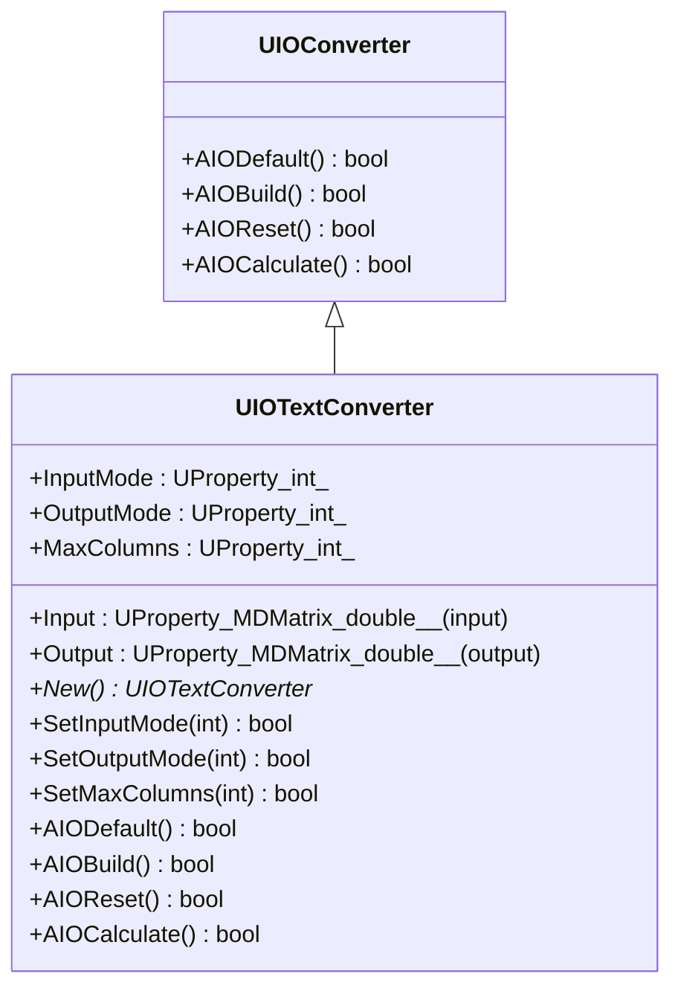
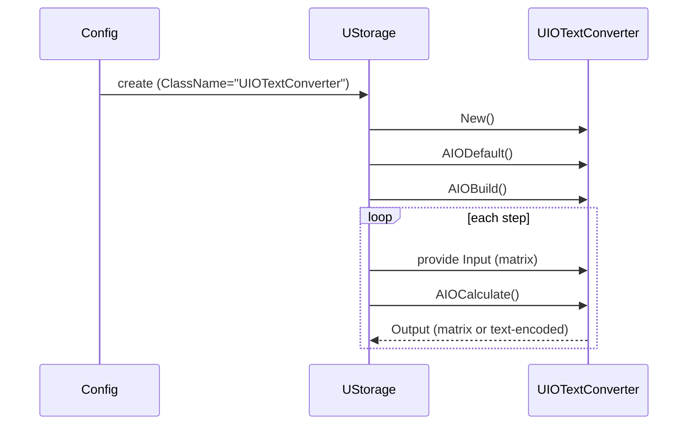
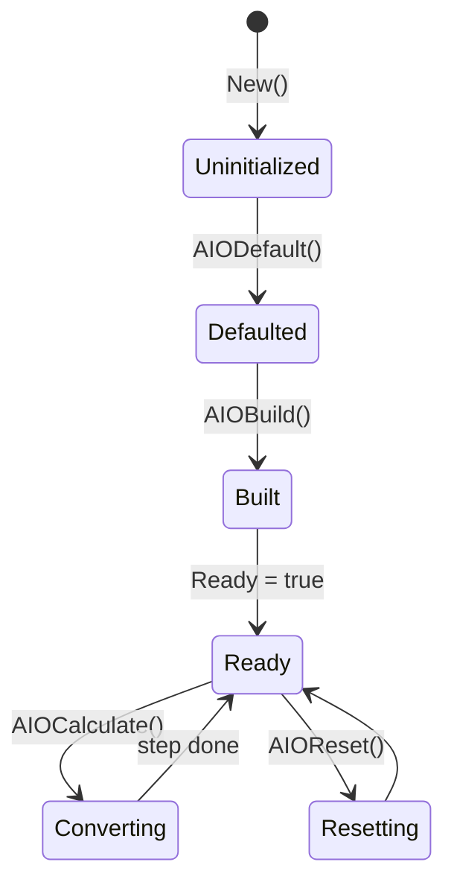
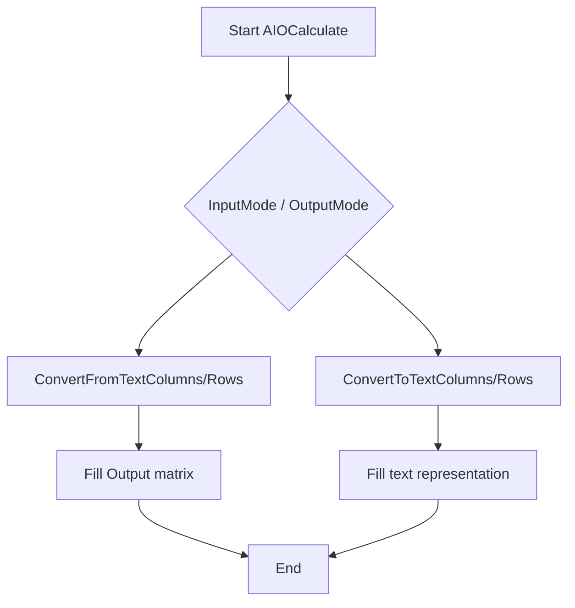
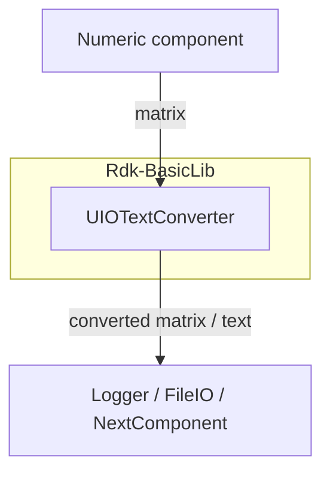

## UIOTextConverter — текстовый конвертер IO (Rdk-BasicLib)

## RU

### Назначение

**Класс**: `UIOTextConverter` — компонент для преобразования матричных данных между внутренним форматом и текстовым представлением.  
**Базовый класс**: `UIOConverter`.  
Используется для подготовки данных к экспорту/логированию или, наоборот, для чтения текстовых матриц.

### UML-диаграмма классов



### UML-диаграмма последовательности



### UML-диаграмма состояний



### UML-диаграмма активности



### UML-диаграмма компонентов



### Свойства

По `UIOTextConverter.h`:

- **`InputMode`** (`int`, `ptPubParameter`) — режим интерпретации входного текста:
  - 0 — не использовать входной текст.
  - 1 — текст в колонках → матрица.
  - 2 — текст в строках → матрица.
- **`OutputMode`** (`int`, `ptPubParameter`) — режим формирования текстового вывода:
  - 0 — не формировать текст.
  - 1 — матрица → текст в колонках.
  - 2 — матрица → текст в строках.
- **`MaxColumns`** (`int`, `ptPubParameter`) — ограничение по количеству столбцов при формировании текста.
- **`Input`** (`UProperty<MDMatrix<double>, ..., ptInput>`) — входная матрица.
- **`Output`** (`UProperty<MDMatrix<double>, ..., ptOutput>`) — результат преобразования (может трактоваться как текстовая или числовая форма в зависимости от режима и обвязки).

Внутренние поля:

- `OutData` — строковый буфер.
- `Separate1`, `Separate2` — разделители для парсинга.
- `DataAfterRead` — промежуточная структура данных после чтения текста.

### Методы

- `UIOTextConverter()`, `~UIOTextConverter()` — конструктор/деструктор.
- `virtual UIOTextConverter* New()` — фабрика экземпляров.
- `SetInputMode`, `SetOutputMode`, `SetMaxColumns` — настройка режима работы.
- `AIODefault`, `AIOBuild`, `AIOReset`, `AIOCalculate` — жизненный цикл.
- `ConvertFromTextColumns`, `ConvertFromTextRows` — разбор текстового потока в структуру `UItemData`.
- `ConvertToTextColumns`, `ConvertToTextRows` — генерация текстового представления из набора `UItemData`.

### Примеры использования в C++

```cpp
#include "UIOTextConverter.h"

using namespace RDK;

void ConvertMatrixToText(const MDMatrix<double>& src, std::string& outText)
{
    UIOTextConverter* conv = new UIOTextConverter();
    conv->AIODefault();
    conv->SetOutputMode(1);   // столбцовый формат
    conv->SetMaxColumns(8);
    conv->AIOBuild();

    *conv->Input = src;
    conv->AIOCalculate();

    // доступ к OutData обычно идёт через обвязку UIOConverter/FileIO
    delete conv;
}
```

### Примеры использования в конфигурациях

Типовой фрагмент:

```xml
<IOTextConverter Class="UIOTextConverter">
    <Parameters>
        <InputMode Type="i" PType="257" IoType="17">0</InputMode>
        <OutputMode Type="i" PType="257" IoType="17">1</OutputMode>
        <MaxColumns Type="i" PType="257" IoType="17">8</MaxColumns>
    </Parameters>
</IOTextConverter>
```

---

## UIOTextConverter — IO text converter (Rdk-BasicLib)

## EN

### Purpose

**Class**: `UIOTextConverter` converts matrices between internal numeric representation and textual form (rows/columns).  
It is typically used together with `UFileIO` or logging components.

### Notes

- Modes `InputMode` and `OutputMode` control how text is parsed or generated (rows vs columns).
- `MaxColumns` limits the width of textual output for readability.
- Lifecycle and interactions are described by the mermaid diagrams in the RU section. 

