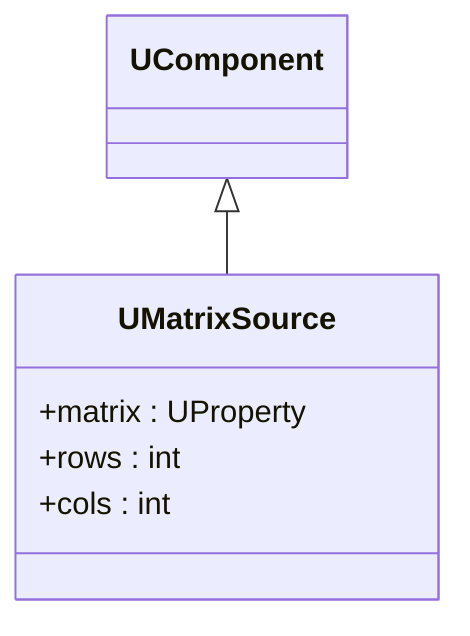
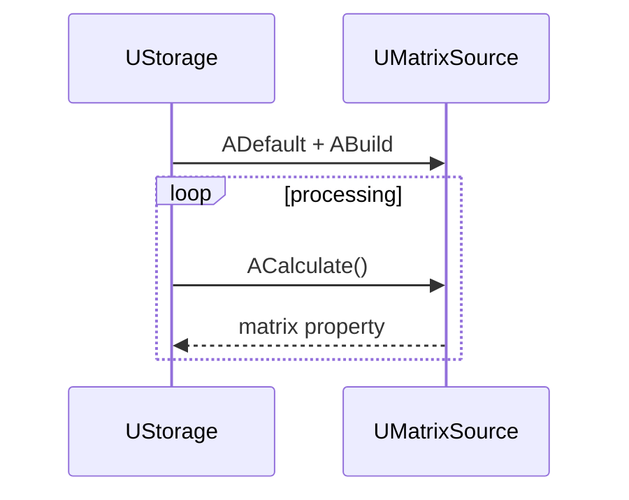

## UMatrixSource — источник матриц (Rdk-BasicLib)

**Класс**: `UMatrixSource` — базовый источник матриц для дальнейшей обработки.  
**Storage-компоненты**: `UploadClass("UMatrixSource", ...)` и специализированные варианты на его основе.

### Класс

### Входы/выходы
- Вход: может отсутствовать (генерация) или использовать конфигурацию/файл.
- Выход: матрица фиксированного/настраиваемого размера.

### Storage-инстансы
- В `ClDesc`/`Configs`: `ClassName = "UMatrixSource"` с указанием размера и источника данных.

Пояснение: диаграмма последовательности показывает типовой сценарий взаимодействия и порядок вызовов.

---

## UMatrixSource — matrix source (Rdk-BasicLib)

**Class**: `UMatrixSource` — provides matrix data as input for pipelines.

