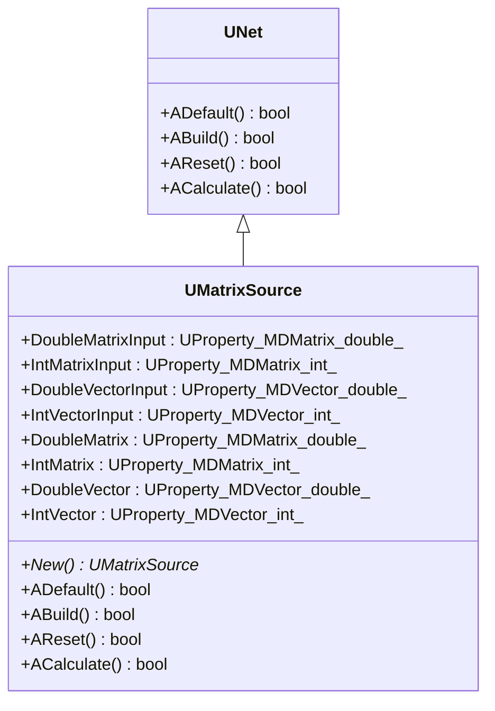
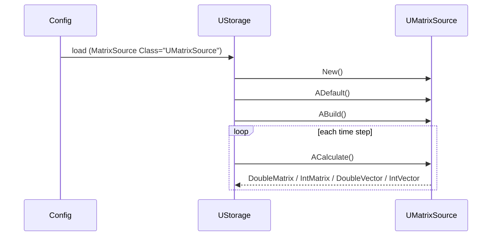
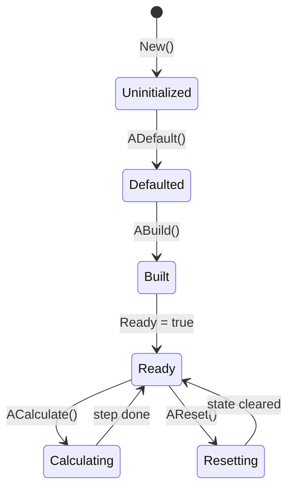
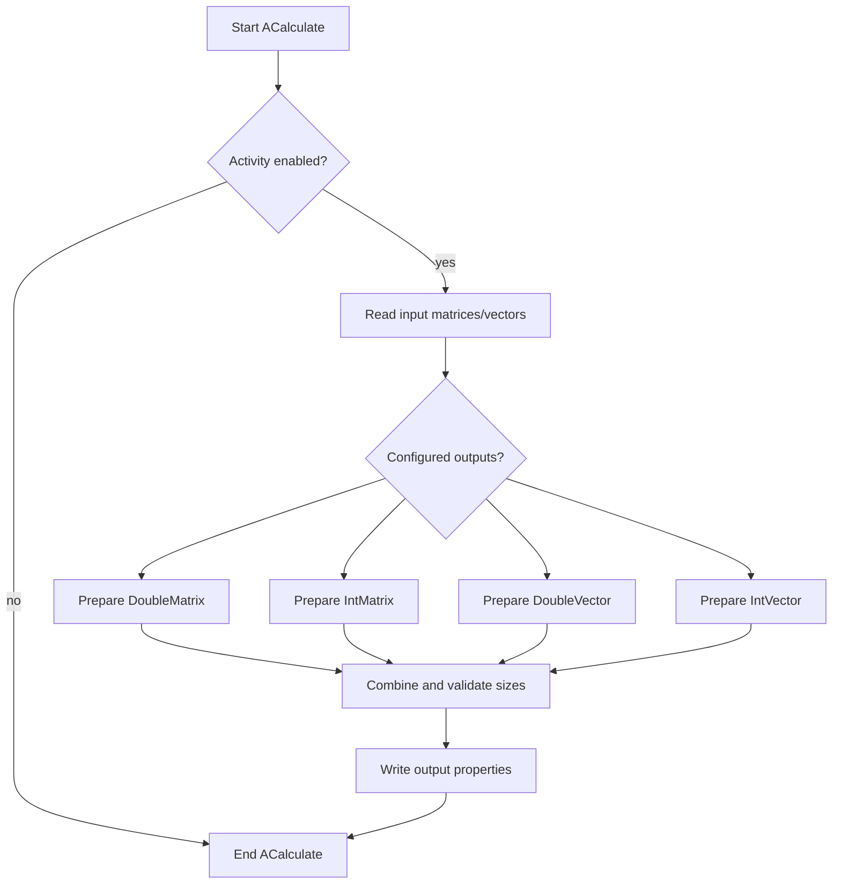
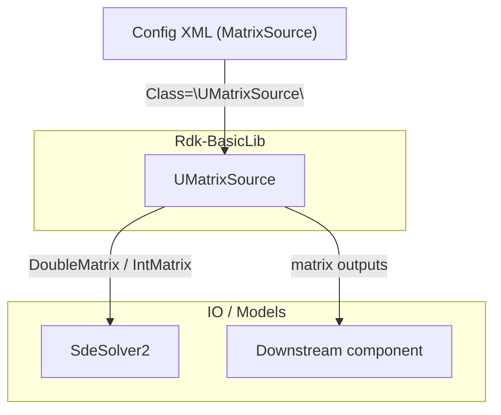

## UMatrixSource — источник матриц (Rdk-BasicLib)

## RU

### Назначение

**Класс**: `UMatrixSource` — базовый источник матриц и векторов для дальнейшей обработки в вычислительных моделях Rdk.  
**Storage-компоненты**: регистрируется как `Class="UMatrixSource"` и используется, например, в конфигурациях `Bin/Configs/Samples/SdeSolver/*`.

Компонент читает или формирует матричные/векторные данные и предоставляет их другим компонентам через выходные `UProperty`.

### UML-диаграмма классов



### UML-диаграмма последовательности



Диаграмма показывает типовой сценарий: конфигурация загружается в `UStorage`, создаётся экземпляр `UMatrixSource`, затем в цикле вычислений вызывается `ACalculate`, обновляющий выходные свойства.

### UML-диаграмма состояний



### UML-диаграмма активности



### UML-диаграмма компонентов



Диаграмма показывает типичное использование `UMatrixSource` как источника данных для численных решателей и других компонентов.

### Свойства

Согласно объявлению в `UMatrixSource.h` и примерам конфигураций:

- **`DoubleMatrixInput`** (`UProperty<MDMatrix<double>, ..., ptPubInput>`) — входная матрица с плавающей точкой.
- **`IntMatrixInput`** (`UProperty<MDMatrix<int>, ..., ptPubInput>`) — входная целочисленная матрица.
- **`DoubleVectorInput`** (`UProperty<MDVector<double>, ..., ptPubInput>`) — входной вектор с плавающей точкой.
- **`IntVectorInput`** (`UProperty<MDVector<int>, ..., ptPubInput>`) — входной целочисленный вектор.
- **`DoubleMatrix`** (`ptPubParameter | ptOutput`) — выходная/параметрическая матрица `MDMatrix<double>`.
- **`IntMatrix`** (`ptPubParameter | ptOutput`) — выходная/параметрическая матрица `MDMatrix<int>`.
- **`DoubleVector`** (`ptPubParameter | ptOutput`) — выходной/параметрический вектор `MDVector<double>`.
- **`IntVector`** (`ptPubParameter | ptOutput`) — выходной/параметрический вектор `MDVector<int>`.

В конфигурационных файлах им соответствуют элементы:

- `<DoubleMatrix Type="MDMatrix&lt;d&gt;" ...>...</DoubleMatrix>`
- `<IntMatrix Type="MDMatrix&lt;i&gt;" ...>...</IntMatrix>`
- `<DoubleVector Type="MDVector&lt;d&gt;" ...>...</DoubleVector>`
- `<IntVector Type="MDVector&lt;i&gt;" ...>...</IntVector>`

### Методы

Ключевые методы жизненного цикла (частично переопределяют поведение `UNet`):

- `UMatrixSource()` / `~UMatrixSource()` — конструктор и деструктор.
- `virtual UMatrixSource* New()` — фабрика для создания нового экземпляра того же типа.
- `virtual bool ADefault()` — установка значений по умолчанию для свойств.
- `virtual bool ABuild()` — подготовка компонента к работе (проверка размеров, инициализация буферов).
- `virtual bool AReset()` — сброс внутренних состояний.
- `virtual bool ACalculate()` — основной вычислительный шаг (обновление выходных матриц и векторов).
- `virtual bool ASDefault()`, `ASBuild()`, `ASReset()`, `ASCalculate()` — служебные варианты жизненных методов (используются внутренней подсистемой).

### Примеры использования в C++

Упрощённый пример прямого использования без `UStorage`:

```cpp
#include "UMatrixSource.h"

using namespace RDK;

void RunMatrixSource()
{
    UMatrixSource* src = new UMatrixSource();

    src->ADefault(); // инициализация свойств по умолчанию
    src->ABuild();   // подготовка к расчётам

    for (int step = 0; step < 10; ++step)
    {
        src->ACalculate();
        // Здесь можно считывать выходные свойства DoubleMatrix / IntMatrix / DoubleVector / IntVector
    }

    src->AReset();   // при необходимости сброс состояния
    delete src;
}
```

На практике `UMatrixSource` обычно управляется `UStorage` и создаётся из конфигурации, а не через `new` вручную.

### Примеры использования в конфигурациях

Фрагмент из `Bin/Configs/Samples/SdeSolver/Parameters_00.xml`:

```xml
<MatrixSource Class="UMatrixSource">
    <Parameters>
        <Activity Type="b" PType="257" IoType="17">1</Activity>
        <DoubleMatrix Type="MDMatrix&lt;d&gt;" Rows="10" Cols="1" PType="273" IoType="17">
            1 0 0 0 0 0 0 0 0 1
        </DoubleMatrix>
        <DoubleVector Type="MDVector&lt;d&gt;" Size="0" PType="273" IoType="17"></DoubleVector>
        <IntMatrix Type="MDMatrix&lt;i&gt;" Rows="0" Cols="0" PType="273" IoType="17"></IntMatrix>
        <IntVector Type="MDVector&lt;i&gt;" Size="0" PType="273" IoType="17"></IntVector>
    </Parameters>
</MatrixSource>
```

---

## UMatrixSource — matrix source (Rdk-BasicLib)

## EN

### Purpose

**Class**: `UMatrixSource` is a basic matrix and vector source for downstream components in Rdk computations.  
It is registered in configs as `Class="UMatrixSource"` and provides `DoubleMatrix`, `IntMatrix`, `DoubleVector`, and `IntVector` properties.

The mermaid diagrams above describe its class structure, lifecycle, states, activity, and role in the `Rdk-BasicLib` component graph.

### Usage notes

- Inputs: optional matrix/vector properties (when `UMatrixSource` is fed from other components).
- Outputs: configured matrices and vectors used by solvers and models.
- Typical lifecycle: `New` → `ADefault` → `ABuild` → repeated `ACalculate` → optional `AReset`.

Configuration examples follow the same XML pattern as in the RU section and other configs in `Bin/Configs`.

