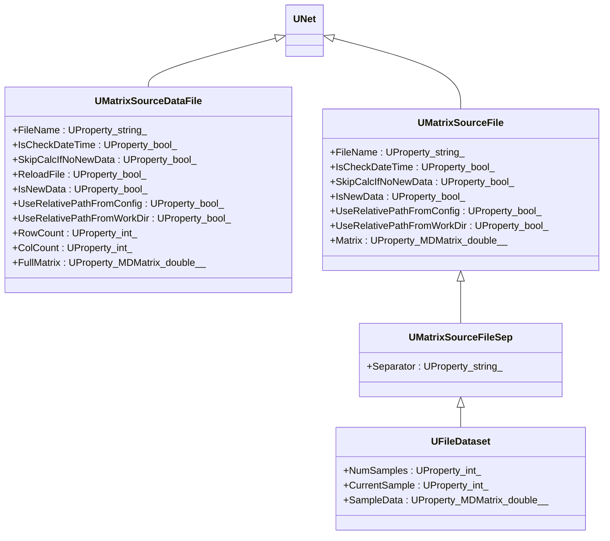
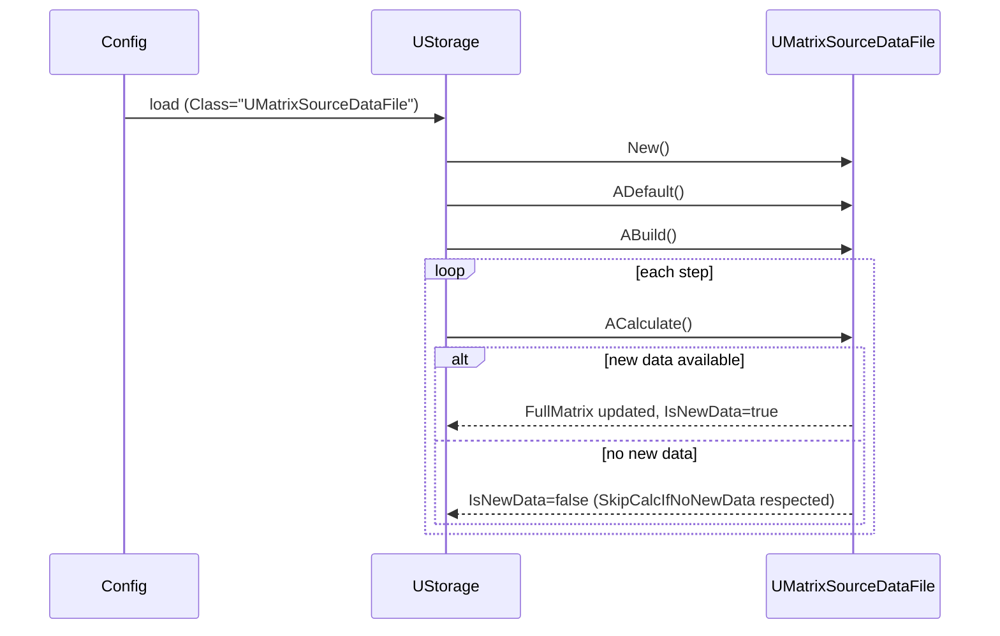
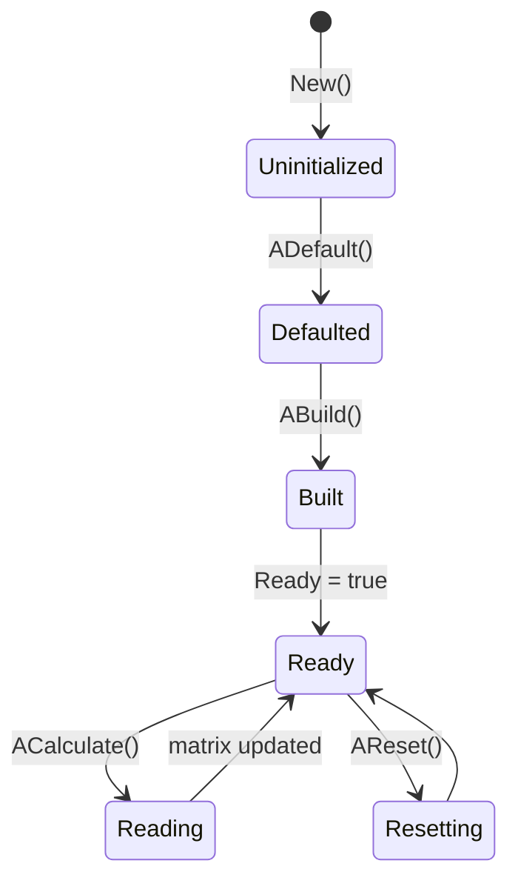
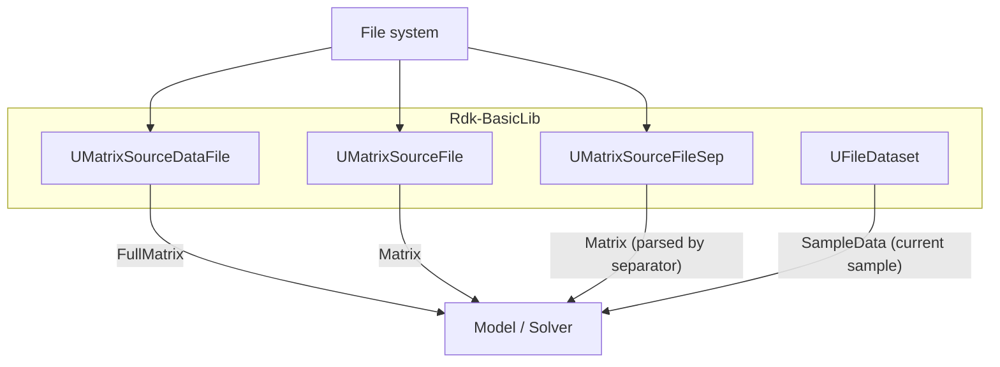

## UMatrixSourceDataFile / UMatrixSourceFile / UMatrixSourceFileSep / UFileDataset — файловые источники матриц (Rdk-BasicLib)

## RU

### Назначение

Семейство компонентов чтения матриц и датасетов из файловых источников:

- `UMatrixSourceDataFile` — чтение матриц из обычных файлов.
- `UMatrixSourceFile` — чтение матриц (Windows‑специфичная реализация, использует `FILETIME`).
- `UMatrixSourceFileSep` — чтение текстовых файлов с разделителями (CSV‑подобный формат).
- `UFileDataset` — работа с наборами файлов/записей (dataset) поверх `UMatrixSourceFileSep`.

### Регистрация

- Файл: `Libraries/Rdk-BasicLib/Core/UBCLLibrary.cpp`.
- Метод: `CreateClassSamples(...)` → `UploadClass("UMatrixSourceDataFile", ...)`, `UploadClass("UMatrixSourceFileSep", ...)`, `UploadClass("UFileDataset", ...)` (часть — под `#ifdef WIN32`).

### UML-диаграмма классов



### UML-диаграмма последовательности (UMatrixSourceDataFile)



### UML-диаграмма состояний (файловые источники)



### UML-диаграмма активности (UMatrixSourceFileSep / UFileDataset)

```mermaid
flowchart TD
    start[Start ACalculate] --> buildPath[CalcActualSourceFilePath(FileName)]
    buildPath --> readFile[ReadAndDecode(file)]
    readFile --> parseSep[Split by Separator]
    parseSep --> fillMatrix[Fill Matrix / SampleData]
    fillMatrix --> updateState[Update RowCount/ColCount or NumSamples/CurrentSample]
    updateState --> endNode[End]
```

### UML-диаграмма компонентов



### Свойства и методы

См. также заголовочные файлы:

- `UMatrixSourceDataFile.h` — подробно задаёт параметры чтения файла, флаги путей и выходную матрицу.
- `UMatrixSourceFile.h` — более простой источник с одной матрицей и проверкой времени изменения файла.
- `UMatrixSourceFileSep.h` — добавляет строковый `Separator` и переопределяет `ReadAndDecode`.
- `UFileDataset.h` — реализует логику по выборке отдельных примеров (`NumSamples`, `CurrentSample`, `SampleData`).

Для всех классов действуют стандартные методы жизненного цикла `ADefault`, `ABuild`, `AReset`, `ACalculate` и фабричный метод `New`.

### Примеры использования в конфигурациях

```xml
<UMatrixSourceDataFile Class="UMatrixSourceDataFile">
    <Parameters>
        <FileName Type="s" PType="257" IoType="17">data/input.txt</FileName>
        <SkipCalcIfNoNewData Type="b" PType="257" IoType="17">1</SkipCalcIfNoNewData>
    </Parameters>
</UMatrixSourceDataFile>
```

```xml
<MatrixSourceFileSep Class="UMatrixSourceFileSep">
    <Parameters>
        <FileName Type="s" PType="257" IoType="17">data/series.csv</FileName>
        <Separator Type="s" PType="257" IoType="17">;</Separator>
    </Parameters>
</MatrixSourceFileSep>
```

```xml
<FileDataset Class="UFileDataset">
    <Parameters>
        <CurrentSample Type="i" PType="257" IoType="17">0</CurrentSample>
    </Parameters>
</FileDataset>
```

---

## File-based matrix sources (Rdk-BasicLib)

## EN

### Purpose

**Classes**: `UMatrixSourceDataFile`, `UMatrixSourceFile`, `UMatrixSourceFileSep`, `UFileDataset` — matrix/dataset loaders from filesystem.  
They read matrices from files (plain or separated text, datasets) and expose them as `UProperty` matrices for models and solvers.

The mermaid diagrams in the RU section describe inheritance, lifecycle, activity and component interactions for the whole family. 

