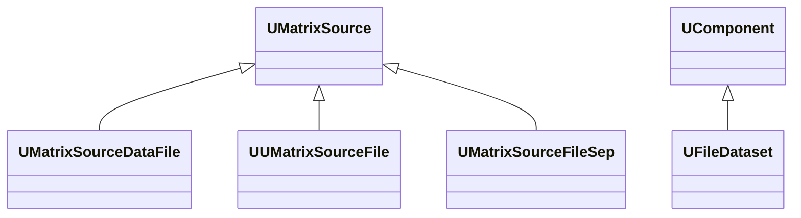

## UMatrixSourceDataFile / UUMatrixSourceFile / UMatrixSourceFileSep / UFileDataset — файловые источники матриц (Rdk-BasicLib)

**Классы**: семейство компонентов чтения матриц/датасетов из файловых источников.  
- `UMatrixSourceDataFile` — чтение матриц из обычных файлов.  
- `UUMatrixSourceFile` — Windows-специфичная реализация.  
- `UMatrixSourceFileSep` — чтение с разделителями.  
- `UFileDataset` — работа с датасетами (набор файлов/записей).

### Регистрация
- Файл: `Libraries/Rdk-BasicLib/Core/UIOLibrary.cpp` (или аналогичный).
- Метод: `CreateClassSamples(...)` с `UploadClass("UMatrixSourceDataFile", ...)` и др.

### Классы

### Входы/выходы
- Вход: путь к файлу/директории, параметры формата.
- Выход: матрицы или наборы данных в `UProperty`.

### Storage-инстансы
- В `ClDesc`/`Configs`: `ClassName = "UMatrixSourceDataFile"` и т.п.; свойства описывают путь, маску файлов, формат строк/разделителей.

---

## File-based matrix sources (Rdk-BasicLib)

**Classes**: `UMatrixSourceDataFile`, `UUMatrixSourceFile`, `UMatrixSourceFileSep`, `UFileDataset` — matrix/dataset loaders from filesystem.

