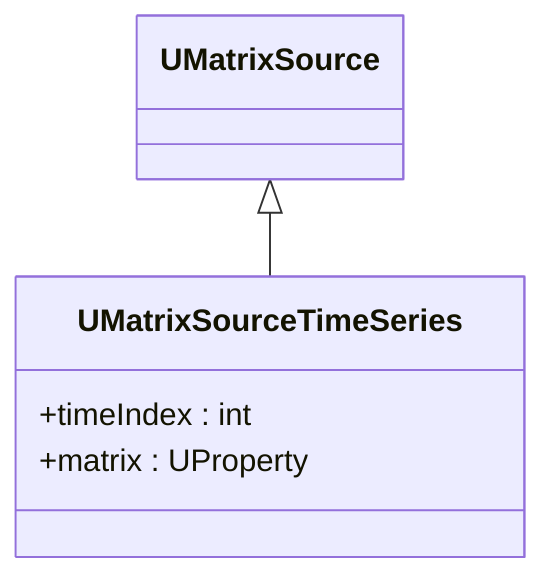

## UMatrixSourceTimeSeries — источник временных рядов матриц (Rdk-BasicLib)

**Класс**: `UMatrixSourceTimeSeries` — выдаёт последовательность матриц как временной ряд.  
**Storage-компоненты**: `UploadClass("UMatrixSourceTimeSeries", ...)`.

### Класс и поток данных



Пояснение: диаграмма классов показывает место компонента в иерархии и ключевые связи.

```mermaid
flowchart LR
    cfg[Config] --> ts[UMatrixSourceTimeSeries]
    ts --> m1[Matrix(t0)]
    ts --> m2[Matrix(t1)]
```

### Входы/выходы
- Выход: матрица/кадр на текущем шаге времени; индекс шага хранится во внутреннем состоянии.

---

## UMatrixSourceTimeSeries — time series matrix source (Rdk-BasicLib)

**Class**: `UMatrixSourceTimeSeries` — produces matrix time series for downstream components.

