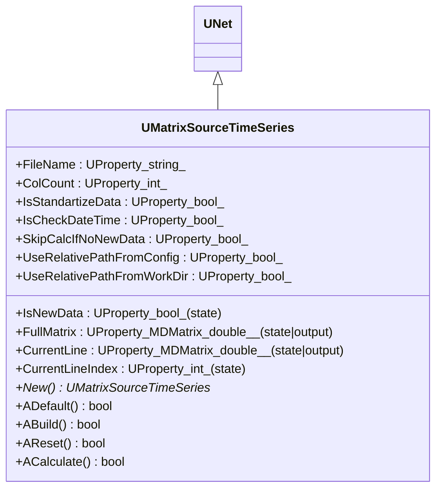
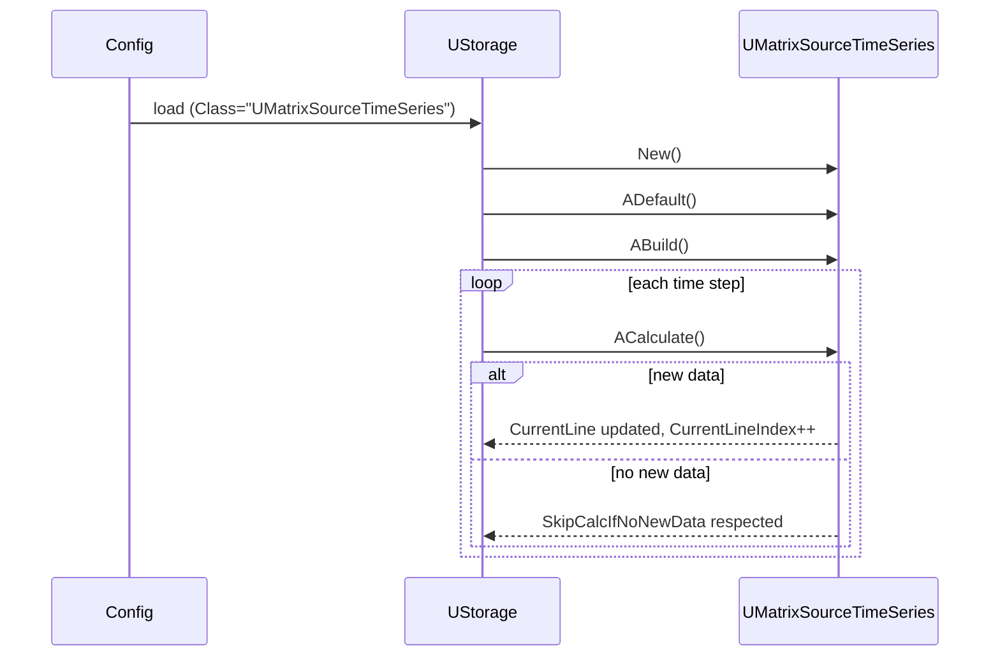
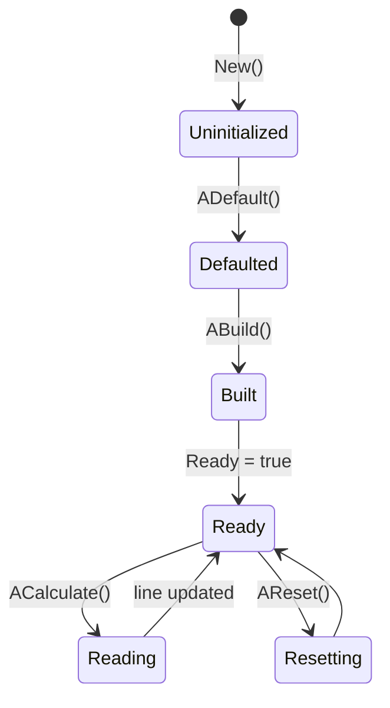

## UMatrixSourceTimeSeries — источник временных рядов матриц (Rdk-BasicLib)

## RU

### Назначение

**Класс**: `UMatrixSourceTimeSeries` — источник временного ряда матриц, считываемых из файла.  
Компонент построчно выдаёт матрицы/кадры на каждом шаге расчёта и отслеживает появление новых данных.

### UML-диаграмма классов



### UML-диаграмма последовательности



### UML-диаграмма состояний



### UML-диаграмма активности

```mermaid
flowchart TD
    start[Start ACalculate] --> buildPath[CalcActualSourceFilePath(FileName)]
    buildPath --> checkNew{New data?}
    checkNew -->|no and SkipCalcIfNoNewData| endSkip[Return without changes]
    checkNew -->|yes| readFile[ReadAndDecode(file)]

    readFile --> transform[TransformData to FullMatrix]
    transform --> standartize{IsStandartizeData?}
    standartize -->|yes| stdData[StandartizeData]
    standartize -->|no| selectLine[UpdateCurrentLine]

    stdData --> selectLine
    selectLine --> updateProps[Set CurrentLine, CurrentLineIndex, IsNewData]
    updateProps --> endNode[Конец]
```

### UML-диаграмма компонентов

```mermaid
graph TB
    subgraph basicLib["Rdk-BasicLib"]
        ts[UMatrixSourceTimeSeries]
    end

    fs[File system (time series file)]
    model[Model / Analyzer]

    fs --> ts
    ts -->|"CurrentLine (matrix at time step)"| model
```

### Свойства

Из `UMatrixSourceTimeSeries.h`:

- `FileName` — путь к файлу с временным рядом.
- `ColCount` — ожидаемое число столбцов.
- `IsStandartizeData` — нужно ли стандартизировать данные.
- `IsCheckDateTime` — проверять ли изменение файла по времени.
- `SkipCalcIfNoNewData` — пропускать ли расчёт при отсутствии новых данных.
- `IsNewData` — флаг наличия новой строки/кадра.
- `UseRelativePathFromConfig`, `UseRelativePathFromWorkDir` — выбор базового пути.
- `FullMatrix` — матрица со всем временным рядом.
- `CurrentLine` — текущая строка/кадр.
- `CurrentLineIndex` — индекс текущей строки.

### Методы

- Конструктор/деструктор, `New`.
- Жизненный цикл: `ADefault`, `ABuild`, `AReset`, `ACalculate`.
- Вспомогательные:
  - `ReadAndDecode` — чтение и разбор файла.
  - `CalcActualSourceFilePath` — вычисление реального пути.
  - `TransformData`, `StandartizeData` — подготовка матрицы.
  - `UpdateCurrentLine` — выбор и обновление текущей строки/кадра.

### Примеры использования в конфигурациях

Фрагменты `!OldConfigs/TimeSeriesTest` и `PCATest` используют:

```xml
<MatrixSourceTimeSeries Class="UMatrixSourceTimeSeries">
    <Parameters>
        <FileName Type="s" PType="257" IoType="17">data/timeseries.csv</FileName>
        <ColCount Type="i" PType="257" IoType="17">3</ColCount>
        <IsStandartizeData Type="b" PType="257" IoType="17">1</IsStandartizeData>
    </Parameters>
</MatrixSourceTimeSeries>
```

---

## UMatrixSourceTimeSeries — time series matrix source (Rdk-BasicLib)

## EN

### Purpose

**Class**: `UMatrixSourceTimeSeries` produces a matrix time series from a file, exposing both the full matrix and the current line/frame.  
Typical usage is in time‑series analysis, PCA tests and similar experiments.

The mermaid diagrams in the RU section describe its inheritance, lifecycle, state, activity and role in `Rdk-BasicLib` processing pipelines.


```mermaid
flowchart TD
    start[Start ACalculate] --> buildPath[CalcActualSourceFilePath(FileName)]
    buildPath --> checkNew{New data?}
    checkNew -->|no and SkipCalcIfNoNewData| endSkip[Return without changes]
    checkNew -->|yes| readFile[ReadAndDecode(file)]

    readFile --> transform[TransformData to FullMatrix]
    transform --> standartize{IsStandartizeData?}
    standartize -->|yes| stdData[StandartizeData]
    standartize -->|no| selectLine[UpdateCurrentLine]

    stdData --> selectLine
    selectLine --> updateProps[Set CurrentLine, CurrentLineIndex, IsNewData]
    updateProps --> endNode[End]
```

```mermaid
graph TB
    subgraph basicLib["Rdk-BasicLib"]
        ts[UMatrixSourceTimeSeries]
    end

    fs[File system (time series file)]
    model[Model / Analyzer]

    fs --> ts
    ts -->|"CurrentLine (matrix at time step)"| model
```

## UMatrixSourceTimeSeries — time series matrix source (Rdk-BasicLib)
