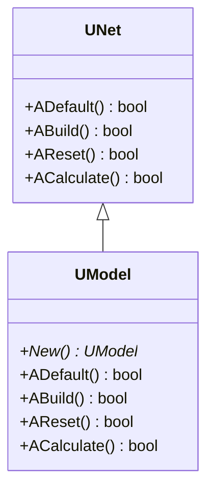
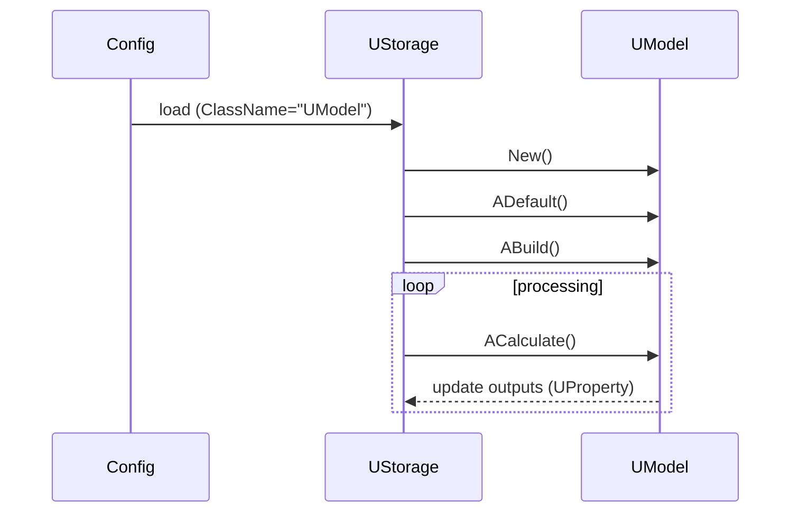
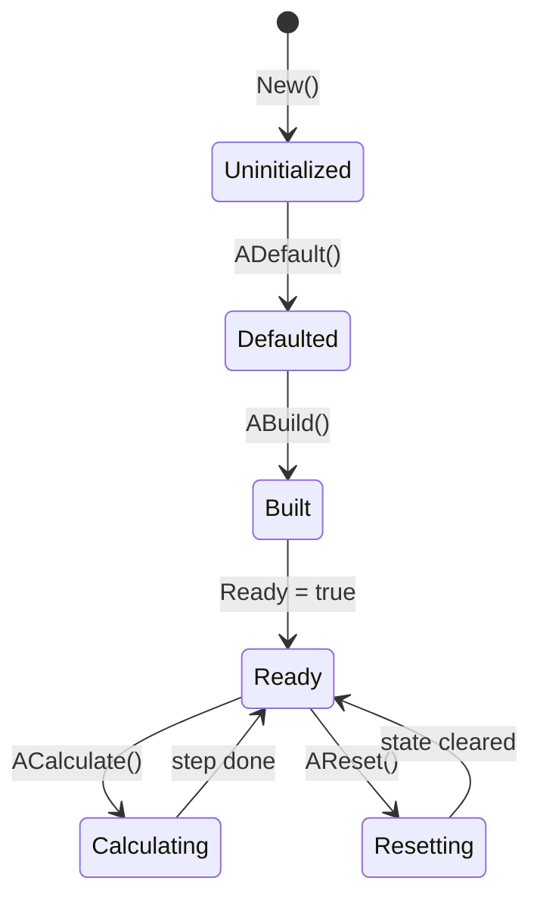
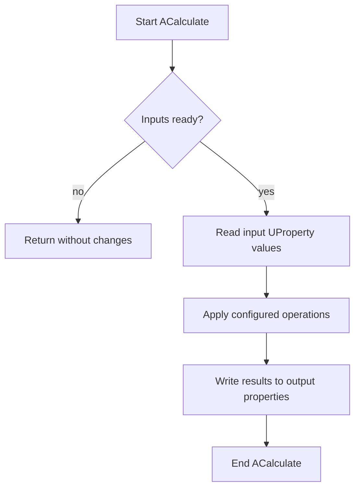
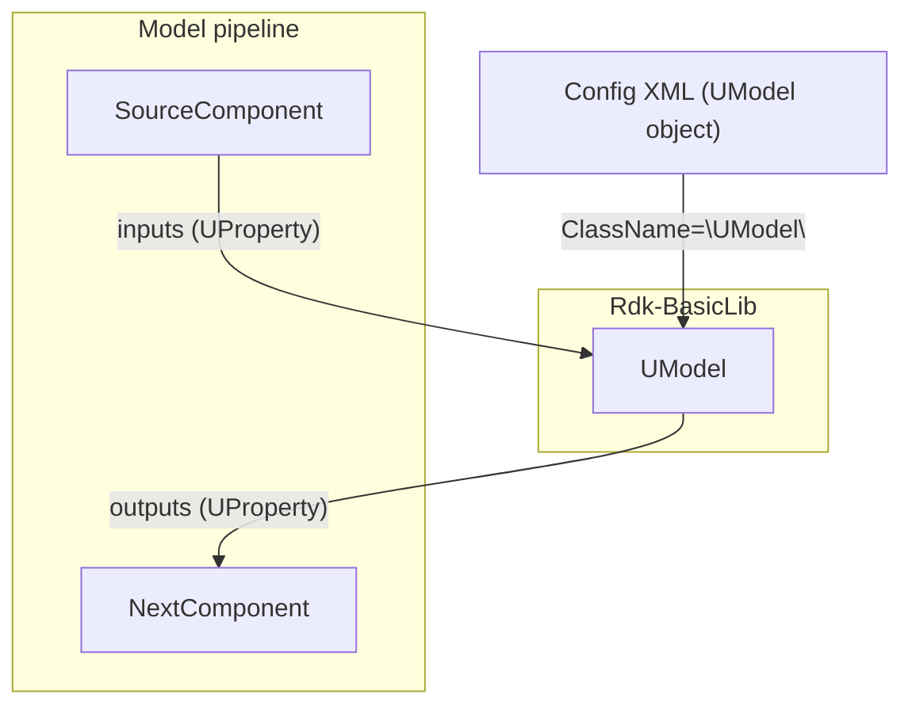

## UModel — базовая модель (Rdk-BasicLib)

## RU

**Класс**: `UModel` — универсальный контейнер вычислений над `UProperty` (матрицы, скаляры и другие данные), построенный на основе базового класса `UNet`.  
**Storage-компоненты**: регистрируется в `CreateClassSamples` (`UBCLLibrary.cpp`) как компонент `UModel`, доступный через `UStorage`.

### Регистрация в UStorage

- Файл: `Libraries/Rdk-BasicLib/Core/UBCLLibrary.cpp` (или аналогичный).
- Место: `CreateClassSamples(...)` → `UploadClass("UModel", ...)`.
- В конфигурациях `Bin/ClDesc` / `Bin/Configs` указывается как `ClassName = "UModel"`.

### UML-диаграмма классов

`UModel` не добавляет собственных `UProperty` в заголовочном файле, а использует инфраструктуру `UNet` и конфигурации для определения конкретных входов/выходов.

### UML-диаграмма последовательности

### UML-диаграмма состояний

### UML-диаграмма активности

`UModel` выступает как «контейнер» вычислений: конкретная логика задаётся конфигурацией и подключёнными компонентами, а не жёстко зашита в класс.

### UML-диаграмма компонентов

### Входы/выходы (UProperty)

`UModel` сам по себе не определяет жёсткий набор свойств; вместо этого:

- Входы и выходы задаются через описание в `ClDesc`/`Configs`.
- Конкретные `UProperty` (их типы и имена) зависят от контекста задачи и проектной конфигурации.

Типичный сценарий:

- Несколько источников/преобразователей данных подают значения в `UModel`.
- `UModel` комбинирует или обрабатывает их и публикует результат в выходных свойствах.

### Методы и жизненный цикл

Из заголовочного файла `UModel.h`:

- `UModel()` / `~UModel()` — конструктор и деструктор.
- `virtual UModel* New()` — создание новой «чистой» копии объекта этого класса.

Унаследованные методы жизненного цикла из `UNet`:

- `ADefault()` — инициализация внутренних структур и значений по умолчанию.
- `ABuild()` — подготовка модели к работе (проверка связей, выделение буферов).
- `AReset()` — сброс временных состояний.
- `ACalculate()` — выполнение одного шага вычислений.

### Storage-инстансы и конфигурации

- В `ClDesc`/`Configs` компонент описывается через `ClassName = "UModel"` и набор свойств (имя, параметры, соединения).
- Один и тот же класс `UModel` может иметь несколько инстансов в `UStorage`, отличающихся:
  - Набором и типами `UProperty`.
  - Подключёнными источниками/потребителями данных.
  - Параметрами расчёта.

---

## UModel — base model (Rdk-BasicLib)

## EN

**Class**: `UModel` is a generic computation container built on top of `UNet` and configured via `UStorage` configs.  
**Storage components**: registered in `CreateClassSamples` as `ClassName="UModel"` and instantiated by `UStorage`.

### Storage registration

- File: `Libraries/Rdk-BasicLib/Core/UBCLLibrary.cpp` (or similar).
- Place: `CreateClassSamples(...)` → `UploadClass("UModel", ...)`.
- In `Bin/ClDesc` / `Bin/Configs` used as `ClassName = "UModel"`.

### Lifecycle

- `ADefault` — initialise internal structures and defaults.
- `ABuild` — validate connections and allocate internal buffers.
- `AReset` — reset transient state.
- `ACalculate` — perform a single computation step according to configuration.

The mermaid diagrams above describe the class relationship (`UNet` → `UModel`), lifecycle, states, activity, and role of `UModel` in `Rdk-BasicLib` processing pipelines.

