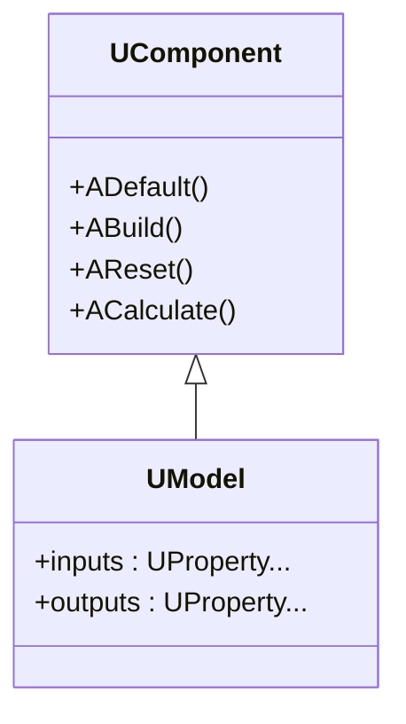
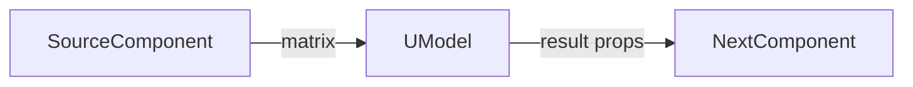
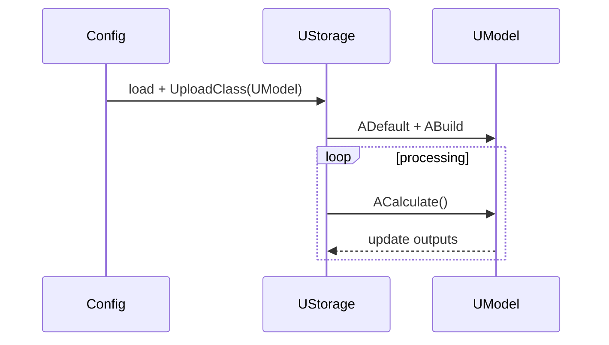

## UModel — базовая модель (Rdk-BasicLib)

**Класс**: `UModel` — универсальный контейнер вычислений над `UProperty` (матрицы, скаляры).  
**Storage-компоненты**: регистрируется в `CreateClassSamples` (`UBCLLibrary.cpp`) как компонент `UModel`, доступный в `UStorage`.

### Регистрация в UStorage
- Файл: `Libraries/Rdk-BasicLib/Core/UBCLLibrary.cpp` (или аналогичный).
- Место: `CreateClassSamples(...)` → `UploadClass("UModel", ...)`.
- В конфигурациях `Bin/ClDesc` / `Bin/Configs` указывается как `ClassName = "UModel"`.

### Иерархия и класс (Class)

### Жизненный цикл
- **ADefault** — инициализация внутренних свойств и связей.
- **ABuild** — проверка подключений, подготовка внутренних буферов.
- **ACalculate** — выполнение шага вычислений согласно конфигурации/подключённым компонентам.

### Входы/выходы (UProperty)
- Входы: произвольные `UProperty` (матрицы, скаляры), приходящие из других компонентов.
- Выходы: `UProperty`, содержащие результат вычислений, доступный через соединения.

### Storage-инстансы и конфигурации
- В `ClDesc`/`Configs` компонент описывается через `ClassName = "UModel"` и набор свойств (имя, параметры, соединения).
- Один и тот же класс `UModel` может иметь несколько инстансов в `UStorage`, отличающихся настройками и связями.

Пояснение: блок-схема показывает поток данных/сигналов (входы → компонент → выходы).

### Типовой сценарий (Sequence)

Пояснение: диаграмма последовательности показывает типовой сценарий взаимодействия и порядок вызовов.

---

## UModel — base model (Rdk-BasicLib)

**Class**: `UModel` — generic computation container over `UProperty` (matrices, scalars).  
**Storage components**: registered in `CreateClassSamples` as `UModel` component available in `UStorage`.

### Storage registration
- File: `Libraries/Rdk-BasicLib/Core/UBCLLibrary.cpp` (or similar).
- Place: `CreateClassSamples(...)` → `UploadClass("UModel", ...)`.
- In `Bin/ClDesc` / `Bin/Configs` used as `ClassName = "UModel"`.

### Lifecycle
- **ADefault** — initialise properties and defaults.
- **ABuild** — validate connections and prepare buffers.
- **ACalculate** — perform computation step according to configuration.

