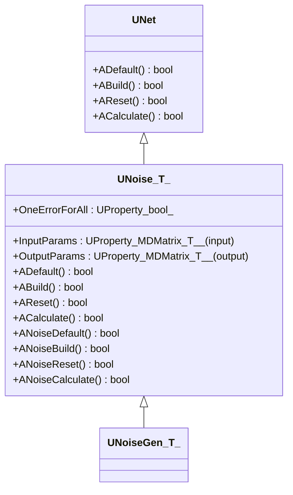
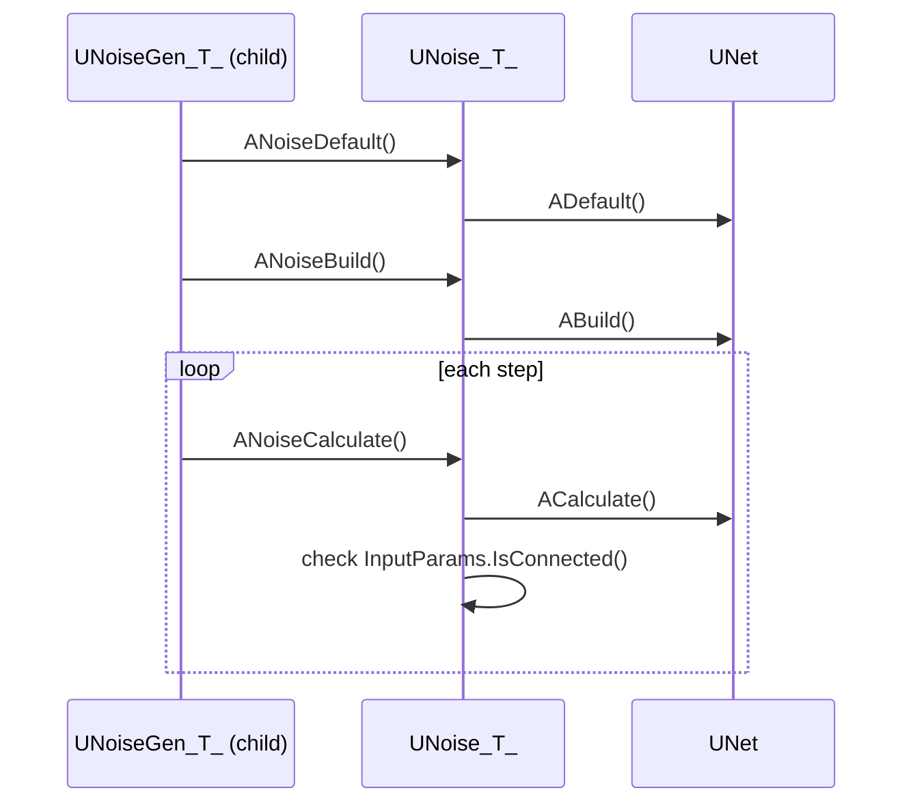
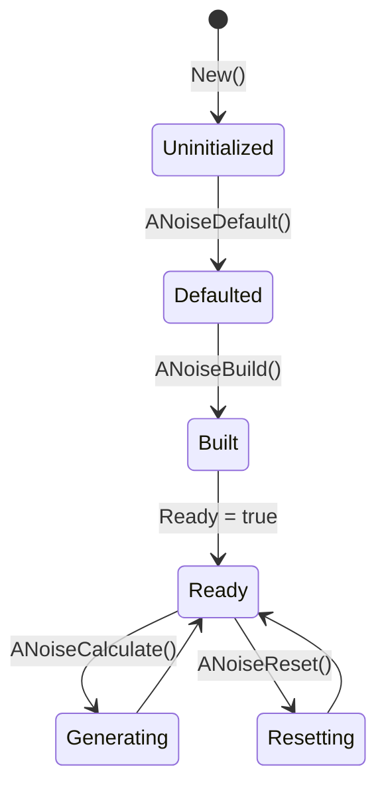
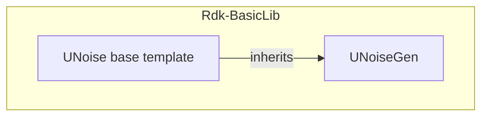

## UNoise — базовый шаблонный класс генераторов шума (Rdk-BasicLib)

## RU

### Назначение

**Класс-шаблон**: `UNoise<T>` — базовый шаблонный класс для генераторов аддитивного шума над матрицами типа `T`.  
**Базовый класс**: `UNet`.  
Не регистрируется напрямую в `UStorage`, используется как родительский класс для специализированных генераторов (например, `UNoiseGen<double>`, `UNoiseGen<int>`).

### UML-диаграмма классов



### UML-диаграмма последовательности



### UML-диаграмма состояний



### UML-диаграмма активности

```mermaid
flowchart TD
    start[Start ACalculate] --> checkConnected{InputParams.IsConnected()?}
    checkConnected -->|no| endNoOp[Return true without changes]
    checkConnected -->|yes| callNoise[Call ANoiseCalculate()]
    callNoise --> endNode[Конец]
```

### UML-диаграмма компонентов



### Свойства

Из `UNoise.h`:

- **`InputParams`** (`UProperty<MDMatrix<T>, ..., ptPubInput>`) — входная матрица сигнала.
- **`OutputParams`** (`UProperty<MDMatrix<T>, ..., ptPubOutput>`) — выходная матрица с добавленным шумом.
- **`OneErrorForAll`** (`bool`, `ptPubParameter`) — флаг использования одного значения шума для всех элементов матрицы (по умолчанию `false`).

### Методы

Жизненный цикл (два уровня):

- Верхний уровень (наследуется от `UNet`):
  - `ADefault`, `ABuild`, `AReset`, `ACalculate`.
- Специализированный уровень Noise:
  - `ANoiseDefault` — устанавливает `OneErrorForAll = false`.
  - `ANoiseBuild`, `ANoiseReset` — подготовка и сброс (базовая реализация возвращает `true`).
  - `ANoiseCalculate` — абстрактный метод, должен быть переопределён в производных классах (базовая реализация возвращает `true`).

Метод `ACalculate` проверяет подключение `InputParams` и вызывает `ANoiseCalculate`, если вход подключён.

### Использование

`UNoise<T>` не используется напрямую в конфигурациях, но служит базой для:
- `UNoiseGen<double>` → `UNoiseGenDouble`.
- `UNoiseGen<int>` → `UNoiseGenInt`.

---

## UNoise — base noise generator template (Rdk-BasicLib)

## EN

### Purpose

**Template class**: `UNoise<T>` is a base template class for additive noise generators over matrices of type `T`, extending `UNet`.  
It is not registered directly in `UStorage` but serves as a parent for specialized generators like `UNoiseGen<double>` and `UNoiseGen<int>`.

### Notes

- Provides input/output matrix properties (`InputParams`, `OutputParams`) and a flag `OneErrorForAll` for noise generation mode.
- Implements lifecycle methods at both `UNet` level and specialized `ANoise*` level.
- Derived classes must implement `ANoiseCalculate` to add noise to input matrices.
- Mermaid diagrams in the RU section show inheritance, lifecycle and component relationships.
