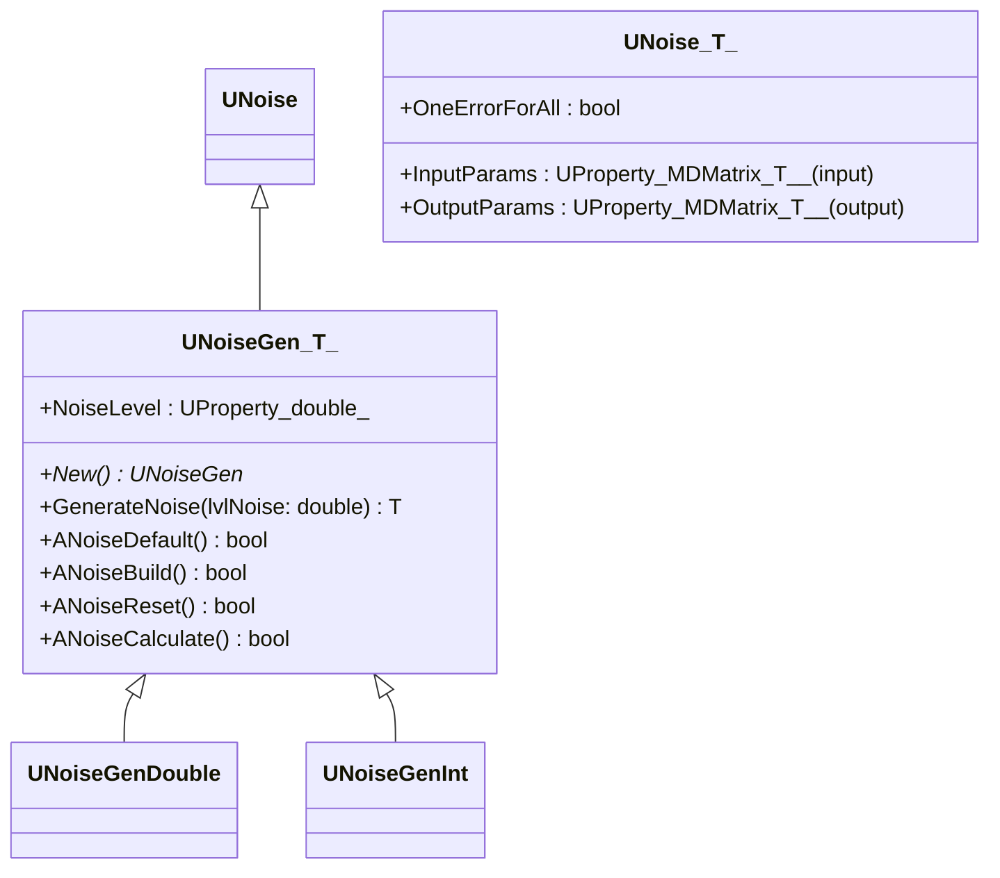
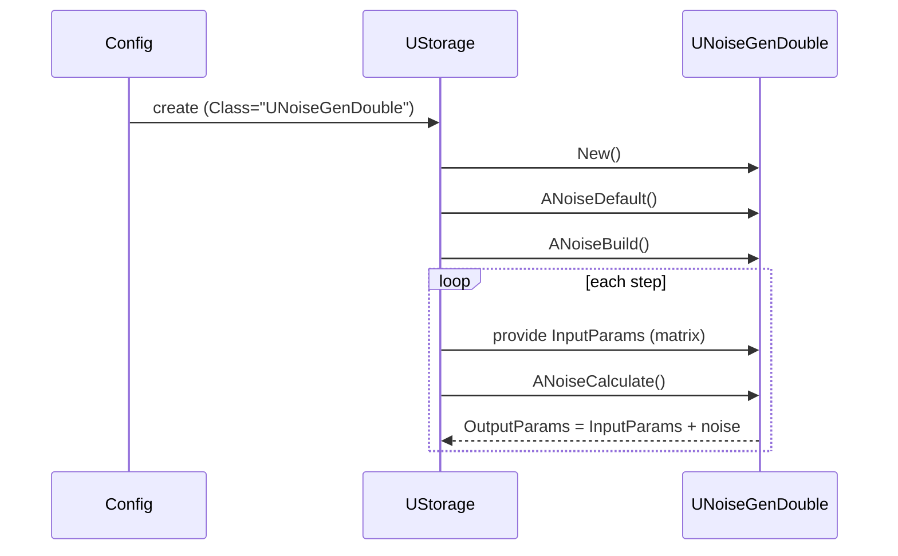
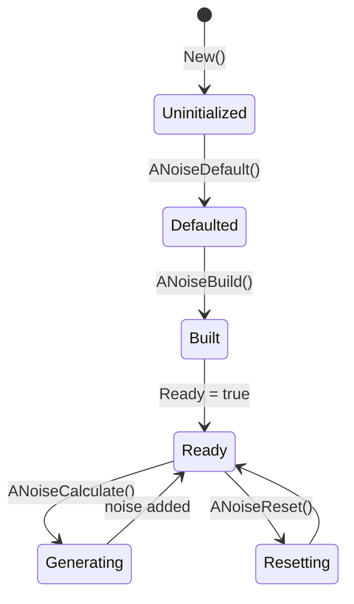

## UNoiseGen / UNoiseGenDouble / UNoiseGenInt — генераторы шума (Rdk-BasicLib)

## RU

### Назначение

**Класс-шаблон**: `UNoiseGen<T>` — генератор аддитивного шума для матриц `MDMatrix<T>`.  
Конкретные типы, регистрируемые в библиотеке:

- `UNoiseGen<double>` → `UNoiseGenDouble`.
- `UNoiseGen<int>` → `UNoiseGenInt`.

Per-class: [`UNoiseGenDouble`](UNoiseGenDouble.md) · [`UNoiseGenInt`](UNoiseGenInt.md).

<a id="unoisegendouble"></a>
### UNoiseGenDouble

См. [`UNoiseGenDouble.md`](UNoiseGenDouble.md) — специализация `UNoiseGen<double>`.

<a id="unoisegenint"></a>
### UNoiseGenInt

См. [`UNoiseGenInt.md`](UNoiseGenInt.md) — специализация `UNoiseGen<int>`.

Компонент добавляет случайный шум к входному сигналу или генерирует шумовой сигнал с заданным уровнем.

### UML-диаграмма классов



### UML-диаграмма последовательности



### UML-диаграмма состояний



### UML-диаграмма активности

```mermaid
flowchart TD
    start[Start ANoiseCalculate] --> resize[Resize OutputParams to InputParams size]
    resize --> mode{OneErrorForAll?}
    mode -->|yes| genSingle[GenerateNoise(NoiseLevel)]
    mode -->|no| loopAll[Loop over all elements]

    genSingle --> fillSingle[Add same noise to all elements]
    fillSingle --> endNode[Конец]

    loopAll --> addEach[For each element: add GenerateNoise(NoiseLevel)]
    addEach --> endNode
```

### UML-диаграмма компонентов

```mermaid
graph TB
    src[Input signal (matrix)] --> noiseGen[UNoiseGenDouble / UNoiseGenInt]
    noiseGen --> out[Noisy signal]
```

### Свойства

По `UNoiseGen.h`:

- `NoiseLevel` (`double`, `ptPubParameter`) — уровень шума (амплитуда).

Унаследованные от `UNoise<T>`:

- `InputParams` — входная матрица сигнала.
- `OutputParams` — выходная матрица с шумом.
- `OneErrorForAll` — использовать один и тот же шум для всех элементов или генерировать новый для каждого.

### Методы

- Конструктор/деструктор, `New`.
- `GenerateNoise(double lvlNoise)` — генерирует одно случайное значение шума (целое или вещественное).
- `ANoiseDefault` — установка `NoiseLevel = 0`.
- `ANoiseBuild` — подготовка генератора.
- `ANoiseReset` — инициализация генератора случайных чисел (`rand` или `std::mt19937`).
- `ANoiseCalculate` — добавляет шум к каждому элементу входной матрицы.

### Примеры использования в C++

```cpp
#include "UNoiseGen.h"

using namespace RDK;

void AddNoise(MDMatrix<double>& signal)
{
    UNoiseGen<double>* gen = new UNoiseGen<double>();
    gen->ANoiseDefault();
    gen->NoiseLevel = 0.1;
    gen->ANoiseBuild();

    *gen->InputParams = signal;
    gen->ANoiseCalculate();
    signal = *gen->OutputParams; // сигнал с шумом

    delete gen;
}
```

---

## UNoiseGen / UNoiseGenDouble / UNoiseGenInt — noise generators (Rdk-BasicLib)

## EN

### Purpose

**Classes**: `UNoiseGen<T>` and its registered specialisations (`UNoiseGenDouble`, `UNoiseGenInt`) implement additive noise for matrix signals.  
They are used for data augmentation, robustness testing and simulating measurement noise.

Mermaid diagrams in the RU section show inheritance from `UNoise<T>`, lifecycle, activity and component interactions.


```mermaid
flowchart TD
    start[Start ANoiseCalculate] --> resize[Resize OutputParams to InputParams size]
    resize --> mode{OneErrorForAll?}
    mode -->|yes| genSingle[GenerateNoise(NoiseLevel)]
    mode -->|no| loopAll[Loop over all elements]

    genSingle --> fillSingle[Add same noise to all elements]
    fillSingle --> endNode[End]

    loopAll --> addEach[For each element: add GenerateNoise(NoiseLevel)]
    addEach --> endNode
```

```mermaid
graph TB
    src[Input signal (matrix)] --> noiseGen[UNoiseGenDouble / UNoiseGenInt]
    noiseGen --> out[Noisy signal]
```

## UNoiseGen / UNoiseGenDouble / UNoiseGenInt — noise generators (Rdk-BasicLib)
