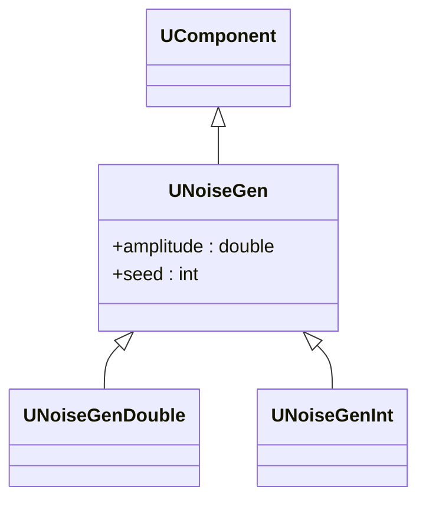
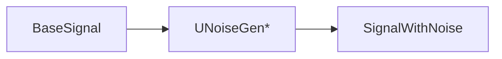

## UNoiseGen / UNoiseGenDouble / UNoiseGenInt — генераторы шума (Rdk-BasicLib)

**Классы**: `UNoiseGen` (базовый), `UNoiseGenDouble`, `UNoiseGenInt` — генераторы аддитивного шума для сигналов.  
**Storage-компоненты**: `UploadClass("UNoiseGen", ...)`, `UploadClass("UNoiseGenDouble", ...)`, `UploadClass("UNoiseGenInt", ...)`.

### Иерархия

### Входы/выходы
- Вход: при необходимости — базовый сигнал (матрица/скаляр).
- Выход: сигнал с добавленным шумом или сгенерированный шум как отдельное свойство.

### Storage-инстансы
- В `ClDesc`/`Configs`: `ClassName = "UNoiseGen*"` с параметрами распределения, амплитуды, seed.

Пояснение: блок-схема показывает поток данных/сигналов (входы → компонент → выходы).

---

## UNoiseGen / UNoiseGenDouble / UNoiseGenInt — noise generators (Rdk-BasicLib)

**Classes**: additive noise generators for signals (double/int), used for augmentation and robustness tests.

