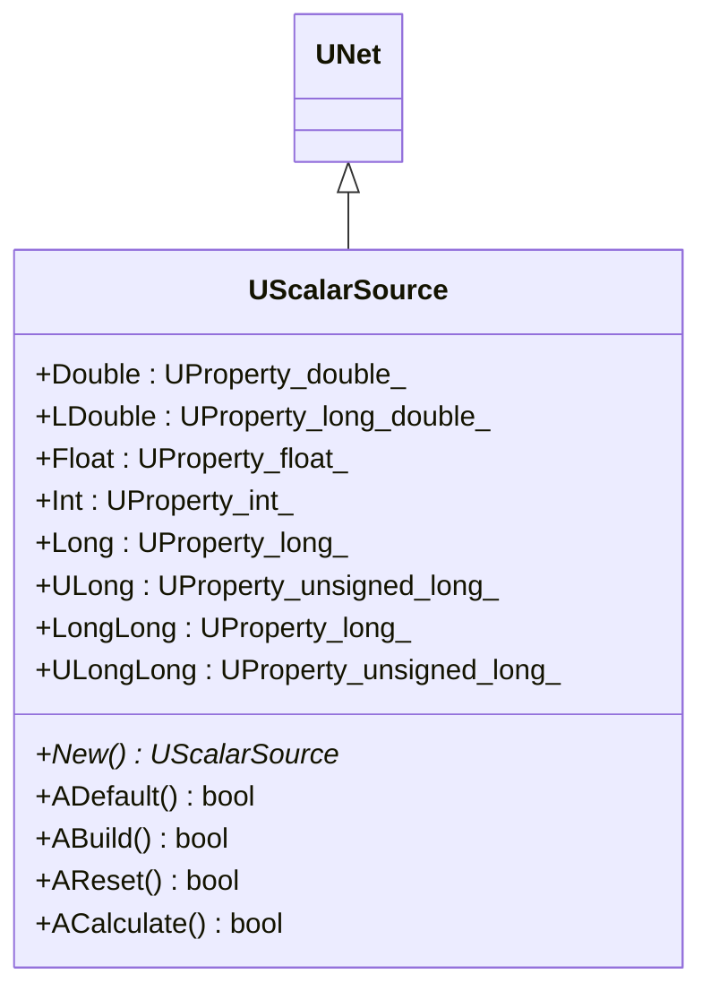
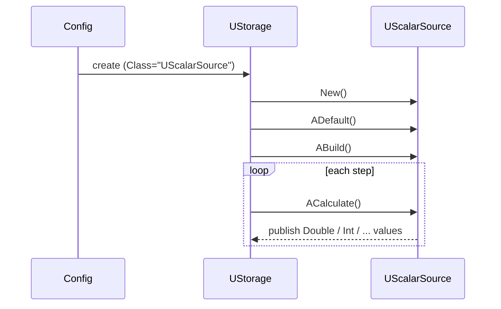
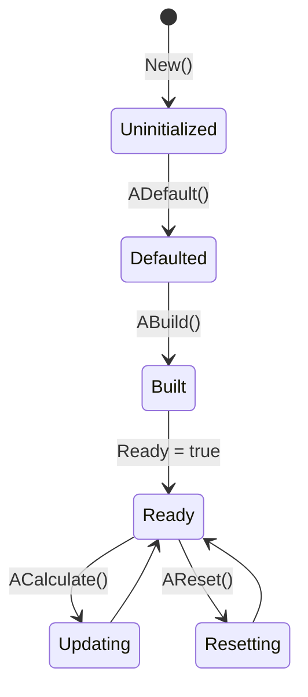
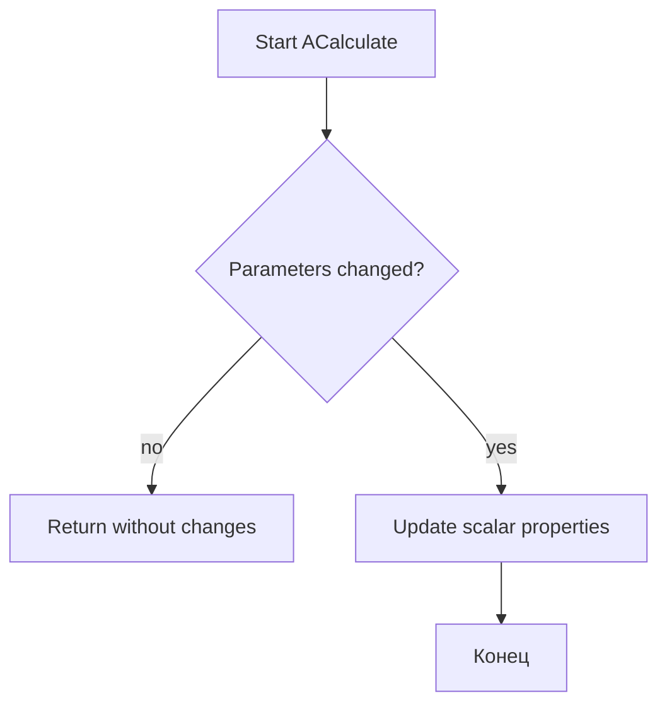
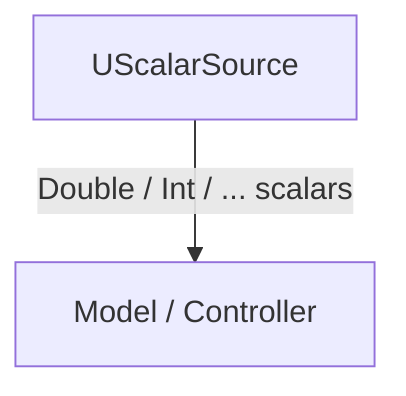

## UScalarSource — источник скаляров (Rdk-BasicLib)

## RU

### Назначение

**Класс**: `UScalarSource` — источник скалярных значений разных типов (double, float, int и др.).  
Компонент хранит значения в `UProperty` и предоставляет их другим компонентам как параметры/выходы.

### UML-диаграмма классов



### UML-диаграмма последовательности



### UML-диаграмма состояний



### UML-диаграмма активности



### UML-диаграмма компонентов



### Свойства

Из `UScalarSource.h`:

- `Double`, `LDouble`, `Float`, `Int`, `Long`, `ULong`, `LongLong`, `ULongLong` — скалярные значения соответствующих типов, помеченные как `ptPubParameter | ptOutput`.

Каждое свойство может быть настроено в конфигурации и далее считываться другими компонентами через соединения.

### Методы

- Конструктор/деструктор, `New`.
- Жизненный цикл: `ADefault`, `ABuild`, `AReset`, `ACalculate`.
- Дополнительно реализованы `ASDefault`, `ASBuild`, `ASReset`, `ASCalculate` — служебные варианты жизненного цикла.

### Примеры использования в C++

```cpp
#include "UScalarSource.h"

using namespace RDK;

void UseScalarSource()
{
    UScalarSource* src = new UScalarSource();
    src->ADefault();
    src->ABuild();

    src->Double = 1.0;
    src->Int = 42;

    src->ACalculate(); // обновление состояний/выходов

    double value = src->Double;
    int index = src->Int;

    delete src;
}
```

### Примеры использования в конфигурациях

```xml
<ScalarSource Class="UScalarSource">
    <Parameters>
        <Double Type="d" PType="257" IoType="17">1.0</Double>
        <Int Type="i" PType="257" IoType="17">42</Int>
    </Parameters>
</ScalarSource>
```

---

## UScalarSource — scalar source (Rdk-BasicLib)

## EN

### Purpose

**Class**: `UScalarSource` provides scalar values of various numeric types (double, float, int, etc.) as parameters/outputs for other components.  
The mermaid diagrams in the RU section describe class structure, lifecycle and interactions. 

