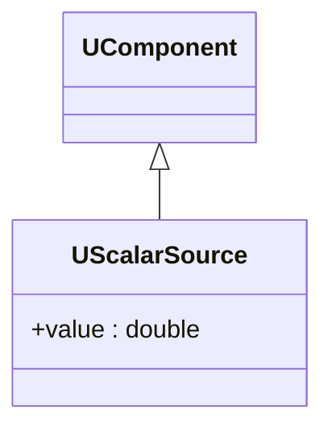

## UScalarSource — источник скаляров (Rdk-BasicLib)

**Класс**: `UScalarSource` — генерирует или предоставляет скалярные значения.  
**Storage-компоненты**: `UploadClass("UScalarSource", ...)`.

### Класс

### Входы/выходы
- Выход: скалярное значение в `UProperty`.

---

## UScalarSource — scalar source (Rdk-BasicLib)

**Class**: `UScalarSource` — scalar value provider for other components.

