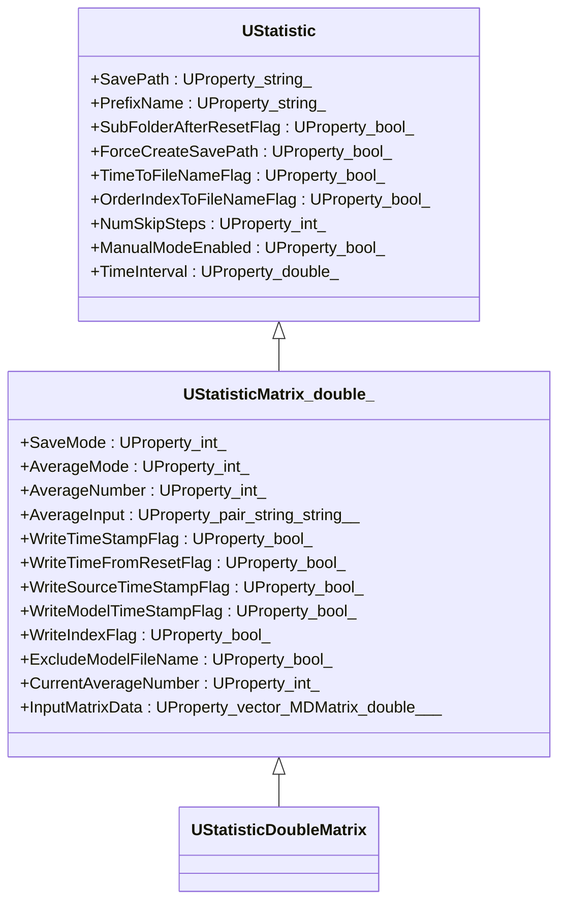
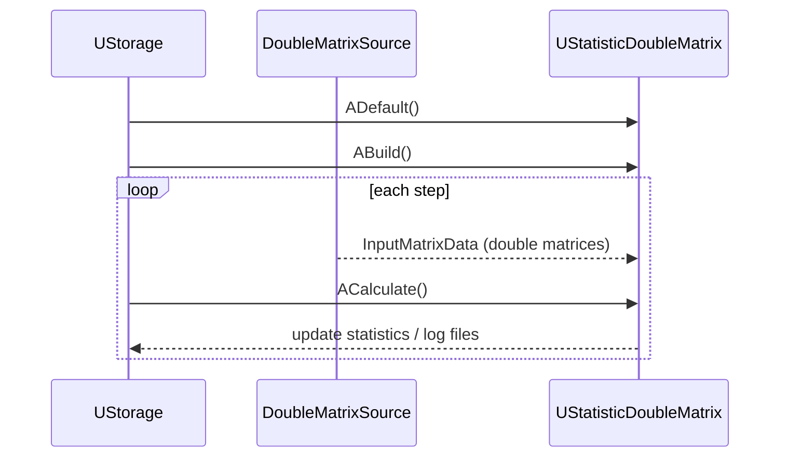
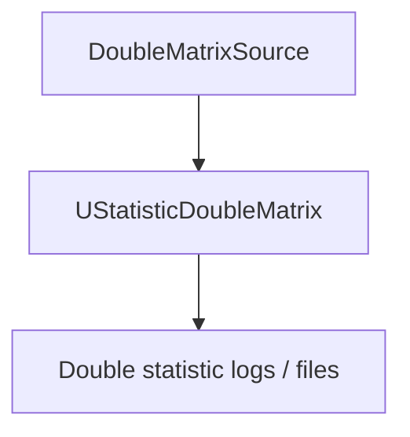

## UStatisticDoubleMatrix — статистика по double-матрицам (Rdk-BasicLib)

## RU

### Назначение

**Класс**: `UStatisticDoubleMatrix` — специализированный вариант `UStatisticMatrix<double>` для матриц с плавающей точкой.  
Собирает и сохраняет статистику по double‑матрицам (среднее, дисперсия, min/max и т.п.).

### Регистрация в UStorage

- Файл: `Libraries/Rdk-BasicLib/Core/UBCLLibrary.cpp`.
- Метод: `CreateClassSamples(...)` → `UploadClass("UStatisticDoubleMatrix", ...)`.
- В `Bin/ClDesc`/`Configs`: `ClassName = "UStatisticDoubleMatrix"`.

### UML-диаграмма классов



### UML-диаграмма последовательности



### UML-диаграмма компонентов



### Входы/выходы

- Вход: double‑матрицы в `InputMatrixData`.
- Выход: статистика, сохраняемая во внутренние структуры и, при необходимости, в файлы.

### Методы и жизненный цикл

Как и в `UStatisticIntMatrix`, логика реализована через базовые методы `UStatistic` и `UStatisticMatrix<double>`:

- `ADefault`, `ABuild`, `AReset`, `ACalculate` — верхний уровень.
- `AFSDefault`, `AFSBuild`, `AFSReset`, `AFSCalculate` — реализация статистики над double‑матрицами.

### Примеры использования в конфигурациях

Компонент используется во множестве конфигов из `Bin/Configs/a.demcheva/*`, например:

```xml
<StatisticDoubleMatrix Class="UStatisticDoubleMatrix">
    <Parameters>
        <SavePath Type="s" PType="257" IoType="17">logs/</SavePath>
        <PrefixName Type="s" PType="257" IoType="17">double_stat</PrefixName>
        <SaveMode Type="i" PType="257" IoType="17">0</SaveMode>
        <AverageMode Type="i" PType="257" IoType="17">0</AverageMode>
    </Parameters>
</StatisticDoubleMatrix>
```

---

## UStatisticDoubleMatrix — double matrix statistics (Rdk-BasicLib)

## EN

### Purpose

**Class**: `UStatisticDoubleMatrix` is a `UStatisticMatrix<double>` specialization for double matrices, computing and logging statistics.  
It is heavily used in motion control and position control configs for numeric diagnostics.

Mermaid diagrams in the RU section show its inheritance, data flow and interaction within `Rdk-BasicLib`.


## UStatisticDoubleMatrix — double matrix statistics (Rdk-BasicLib)
