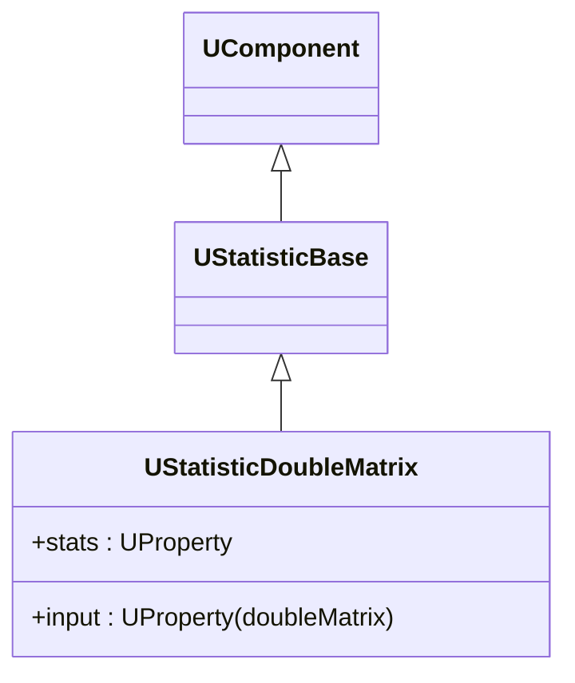

## UStatisticDoubleMatrix — статистика по double-матрицам (Rdk-BasicLib)

**Класс**: `UStatisticDoubleMatrix` — аналог `UStatisticIntMatrix` для матриц с плавающей точкой.  
**Storage-компоненты**: `UploadClass("UStatisticDoubleMatrix", ...)`.

### Класс и иерархия

### Входы/выходы
- Вход: матрица `double`.
- Выход: статистика (среднее, дисперсия, min/max и др.).

### Storage-инстансы
- Описываются в `ClDesc`/`Configs` как `ClassName = "UStatisticDoubleMatrix"` с параметрами окна накопления и т.п.

---

## UStatisticDoubleMatrix — double matrix statistics (Rdk-BasicLib)

**Class**: `UStatisticDoubleMatrix` — statistics over double matrices (mean, variance, etc.).

