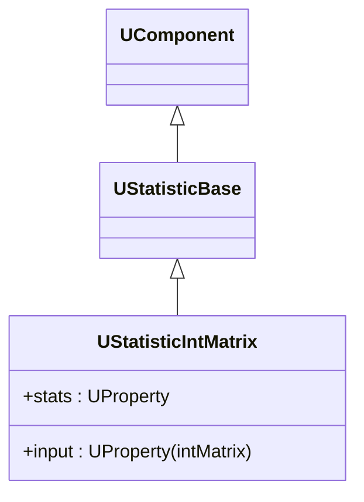
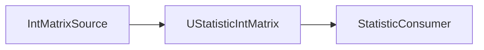
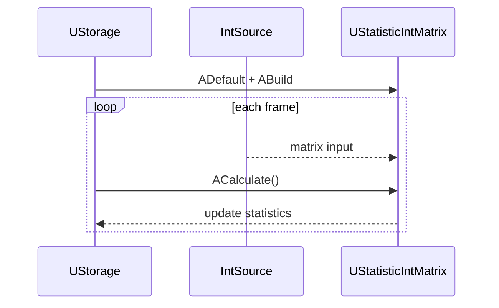

## UStatisticIntMatrix — статистика по int-матрицам (Rdk-BasicLib)

**Класс**: `UStatisticIntMatrix` — собирает статистику по целочисленным матрицам.  
**Storage-компоненты**: регистрируется через `UploadClass("UStatisticIntMatrix", ...)` и используется в пайплайнах анализа.

### Регистрация в UStorage
- Файл: `Libraries/Rdk-BasicLib/Core/UBCLLibrary.cpp`.
- Метод: `CreateClassSamples(...)` → `UploadClass("UStatisticIntMatrix", ...)`.
- В `Bin/ClDesc`/`Configs`: `ClassName = "UStatisticIntMatrix"`.

### Иерархия (Class)

### Жизненный цикл
- **ADefault** — сброс счётчиков и начальных значений.
- **ABuild** — проверка размерности входной матрицы, выделение памяти для накопителей.
- **ACalculate** — при каждом вызове обновляет статистику (среднее, минимум, максимум и т.п.).

### Входы/выходы
- Вход: `UProperty` с int-матрицей.
- Выход: `UProperty` с объектом статистики (значения, гистограммы и др.).

Пояснение: блок-схема показывает поток данных/сигналов (входы → компонент → выходы).

### Типовой сценарий (Sequence)

Пояснение: диаграмма последовательности показывает типовой сценарий взаимодействия и порядок вызовов.

---

## UStatisticIntMatrix — integer matrix statistics (Rdk-BasicLib)

**Class**: `UStatisticIntMatrix` — collects statistics over integer matrices.  
**Usage**: registered in `CreateClassSamples`, used in analysis/reporting pipelines.

