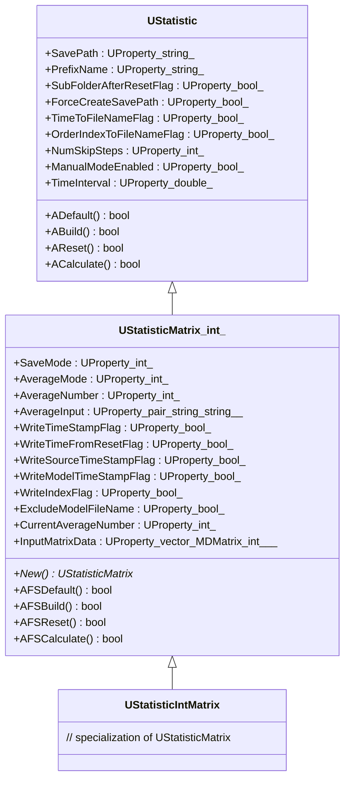
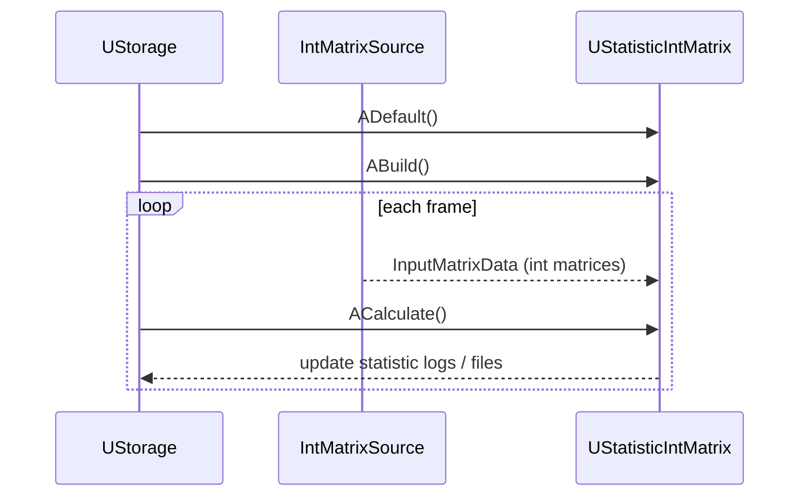
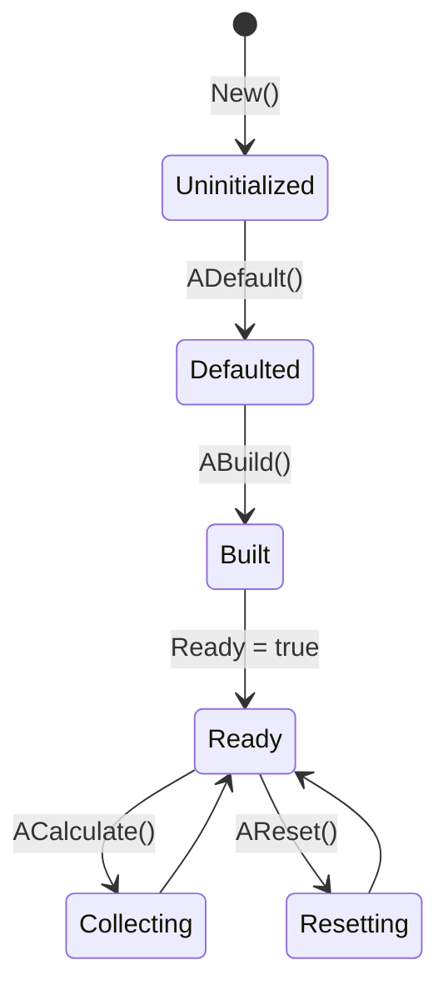
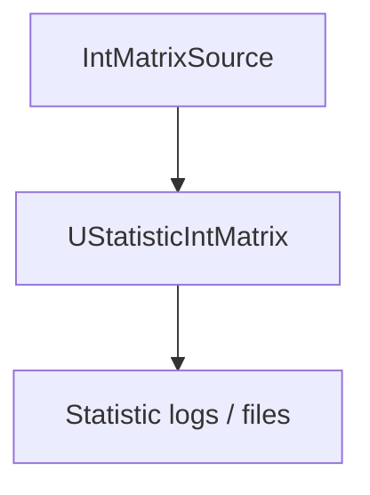

## UStatisticIntMatrix — статистика по int-матрицам (Rdk-BasicLib)

## RU

### Назначение

**Класс**: `UStatisticIntMatrix` — компонент сбора статистики по целочисленным матрицам на основе `UStatisticMatrix<int>`.  
Используется для анализа результатов экспериментов, построения логов и отчётов.

### Регистрация в UStorage

- Файл: `Libraries/Rdk-BasicLib/Core/UBCLLibrary.cpp`.
- Метод: `CreateClassSamples(...)` → `UploadClass("UStatisticIntMatrix", ...)`.
- В `Bin/ClDesc`/`Configs`: `ClassName = "UStatisticIntMatrix"`.

### UML-диаграмма классов



### UML-диаграмма последовательности



### UML-диаграмма состояний



### UML-диаграмма активности

```mermaid
flowchart TD
    start[Start ACalculate] --> checkSkip{Skip step? (NumSkipSteps / TimeInterval)}
    checkSkip -->|yes| endSkip[Return without logging]
    checkSkip -->|no| accumulate[Update averages / counters]
    accumulate --> writeMode{SaveMode / AverageMode}
    writeMode --> writeFiles[Append statistics to log files]
    writeFiles --> endNode[Конец]
```

### UML-диаграмма компонентов



### Свойства

Через базовые классы `UStatistic` и `UStatisticMatrix<int>`:

- Путь и схема именования файлов (`SavePath`, `PrefixName`, `SubFolderAfterResetFlag`, `TimeToFileNameFlag`, `OrderIndexToFileNameFlag` и др.).
- Режимы сохранения (`SaveMode`, `AverageMode`, `AverageNumber`, `AverageInput`).
- Флаги записи временных меток, индексов и других атрибутов.
- Входные матрицы (`InputMatrixData`) и внутренние накопители средних значений и пр.

### Методы и жизненный цикл

- `ADefault`, `ABuild`, `AReset`, `ACalculate` — верхнеуровневые методы `UStatistic`.
- `AFSDefault`, `AFSBuild`, `AFSReset`, `AFSCalculate` — специализированные методы для работы с матрицами типа `int`.

### Примеры использования

Компонент активно используется в конфигурациях управления движением (`MotionControl_Test`, `MultiPositionControl_*`) для логирования выходных матриц:

```xml
<StatisticDoubleMatrix Class="UStatisticIntMatrix">
    <Parameters>
        <SavePath Type="s" PType="257" IoType="17">logs/</SavePath>
        <PrefixName Type="s" PType="257" IoType="17">int_stat</PrefixName>
        <SaveMode Type="i" PType="257" IoType="17">0</SaveMode>
    </Parameters>
</StatisticDoubleMatrix>
```

---

## UStatisticIntMatrix — integer matrix statistics (Rdk-BasicLib)

## EN

### Purpose

**Class**: `UStatisticIntMatrix` (based on `UStatisticMatrix<int>`) collects statistics over integer matrices and writes them to log files.  
It is registered in `CreateClassSamples` and used in analysis/reporting pipelines.

The diagrams in the RU section describe inheritance, lifecycle, activity flow and data paths.


```mermaid
flowchart TD
    start[Start ACalculate] --> checkSkip{Skip step? (NumSkipSteps / TimeInterval)}
    checkSkip -->|yes| endSkip[Return without logging]
    checkSkip -->|no| accumulate[Update averages / counters]
    accumulate --> writeMode{SaveMode / AverageMode}
    writeMode --> writeFiles[Append statistics to log files]
    writeFiles --> endNode[End]
```


## UStatisticIntMatrix — integer matrix statistics (Rdk-BasicLib)
