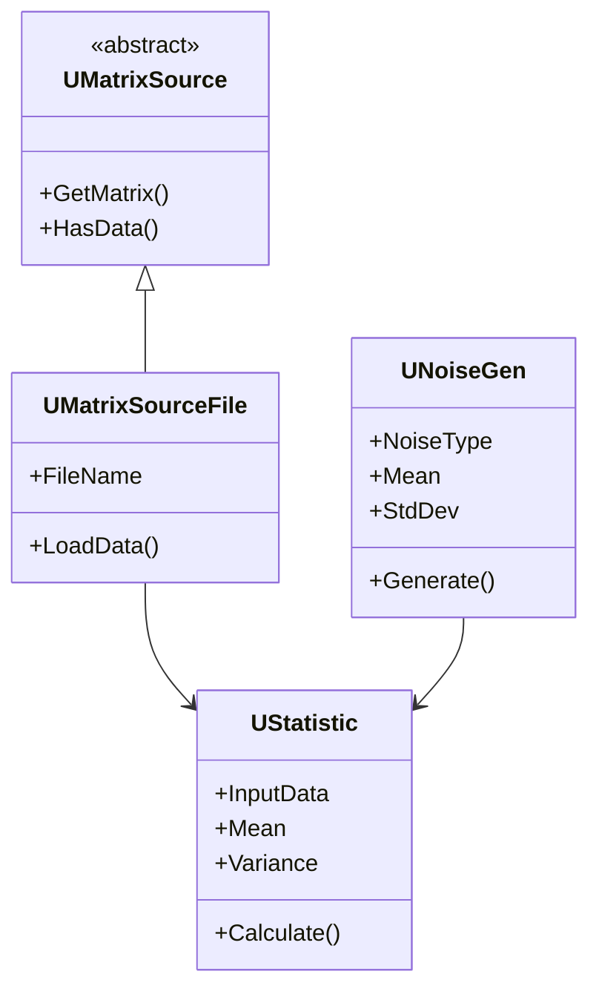

# Взаимодействие компонентов Rdk-BasicLib

## RU

### Диаграмма классов основных компонентов

```mermaid
classDiagram
    class UMatrixSource {
        <<abstract>>
        +GetMatrix()
        +HasData()
    }
    
    class UMatrixSourceFile {
        +FileName
        +LoadData()
    }
    
    class UStatistic {
        +InputData
        +Mean
        +Variance
        +Calculate()
    }
    
    class UNoiseGen {
        +NoiseType
        +Mean
        +StdDev
        +Generate()
    }
    
    UMatrixSource <|-- UMatrixSourceFile
    UMatrixSourceFile --> UStatistic
    UNoiseGen --> UStatistic
```

---

## EN

### Main Component Classes Diagram

```mermaid
classDiagram
    class UMatrixSource {
        <<abstract>>
        +GetMatrix()
        +HasData()
    }
    
    class UMatrixSourceFile {
        +FileName
        +LoadData()
    }
    
    class UStatistic {
        +InputData
        +Mean
        +Variance
        +Calculate()
    }
    
    class UNoiseGen {
        +NoiseType
        +Mean
        +StdDev
        +Generate()
    }
    
    UMatrixSource <|-- UMatrixSourceFile
    UMatrixSourceFile --> UStatistic
    UNoiseGen --> UStatistic
```
