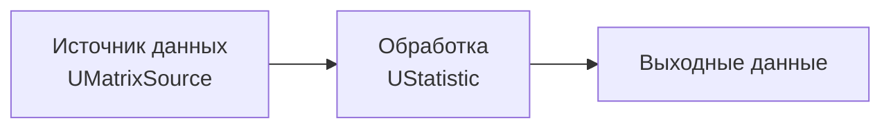
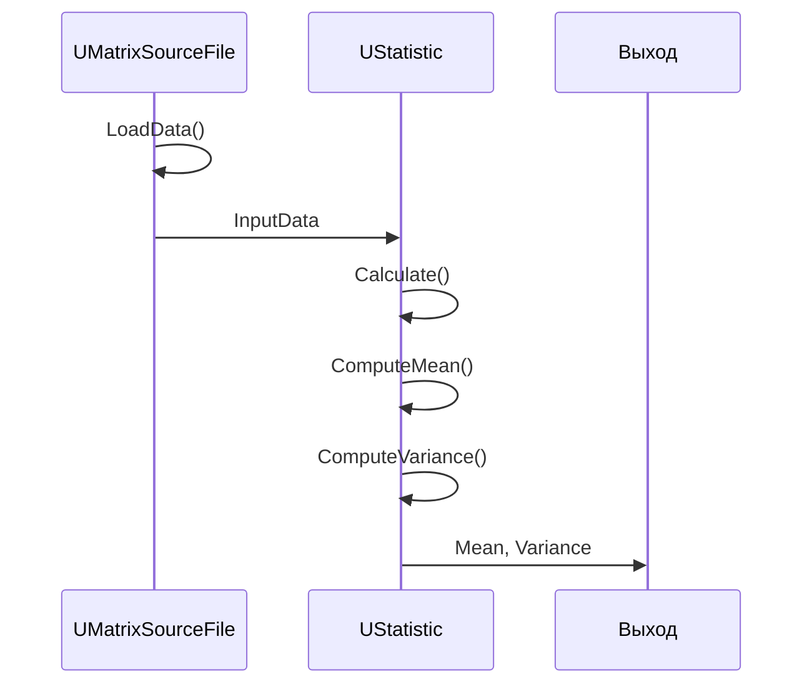

# Поток данных Rdk-BasicLib

## RU

### Общий поток данных

```mermaid
flowchart LR
    Source[Источник данных<br/>UMatrixSource]
    Process[Обработка<br/>UStatistic]
    Output[Выходные данные]
    
    Source --> Process
    Process --> Output
```

### Пример: Статистическая обработка данных

```mermaid
sequenceDiagram
    participant Source as UMatrixSourceFile
    participant Statistic as UStatistic
    participant Output as Выход
    
    Source->>Source: LoadData()
    Source->>Statistic: InputData
    Statistic->>Statistic: Calculate()
    Statistic->>Statistic: ComputeMean()
    Statistic->>Statistic: ComputeVariance()
    Statistic->>Output: Mean, Variance
```

---

## EN

### General Data Flow

### Example: Statistical Data Processing
