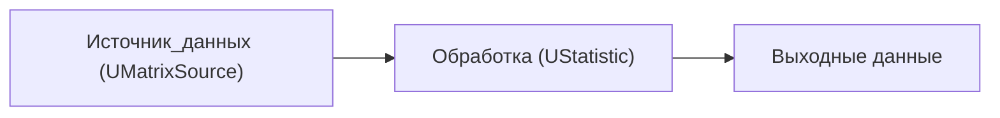
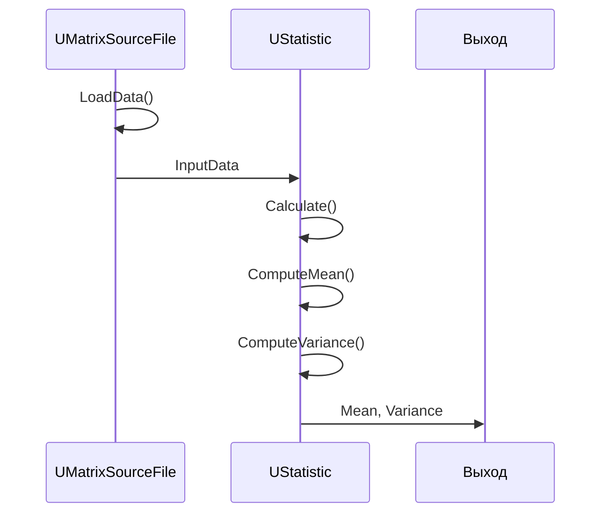
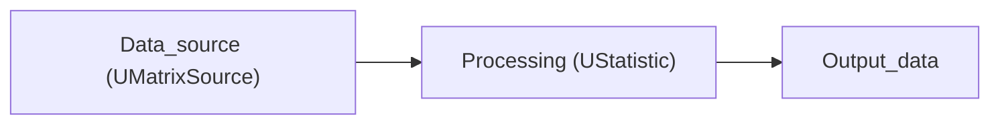

# Поток данных Rdk-BasicLib

## RU

### Общий поток данных

### Пример: Статистическая обработка данных

---

## EN

### General Data Flow

The flowchart shows a simple pipeline: data source produces a matrix, processing component computes statistics, results are sent to output consumers via properties.

### Example: Statistical Data Processing

The sequence diagram in the RU section shows a typical flow: load data → push input → calculate statistics → publish mean/variance.
